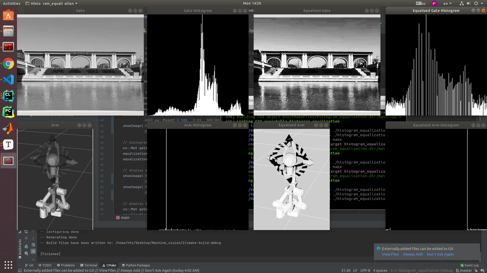
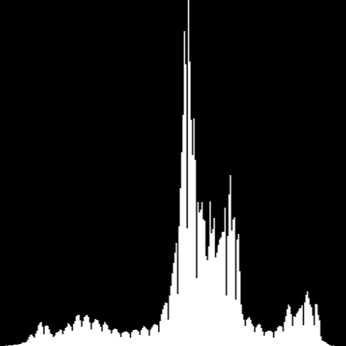
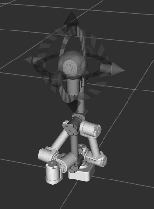
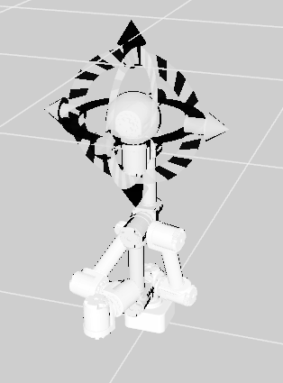
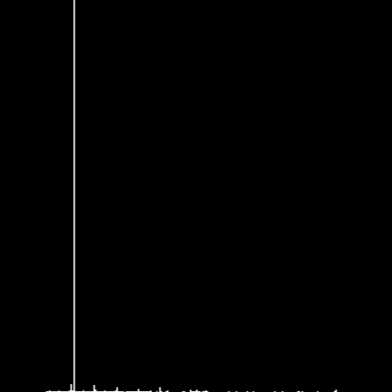
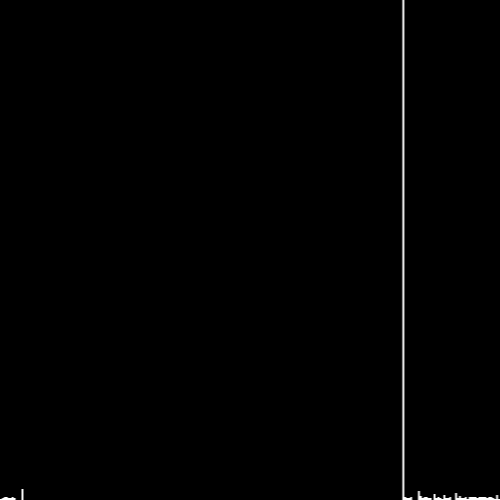

# 直方图均衡化

​	**姓名**： 胡天扬

​	**学号**： 3190105708

​	**专业**： 自动化（控制）

​	**课程**： 数字图像处理与机器视觉	

​	**指导教师**： 姜伟


## 一、题目要求

​		自选一张灰度图像，编程实现直方图均衡处理。

1. 基于累积分布函数实现直方图均衡部分需要自写代码。

2. 以实验报告形式提交结果，报告内容应包括自写源码、直方图均衡处理前后的图像和直方图。


## 二、直方图均衡化基本原理

​		直方图均衡化是一种简单有效的图像增强技术，通过改变图像的直方图来改变图像中各像素的灰度，主要用于增强动态范围偏小的图像的对比度。原始图像由于其灰度分布可能集中在较窄的区间，造成图像不够清晰。例如，过曝光图像的灰度级集中在高亮度范围内，而曝光不足将使图像灰度级集中在低亮度范围内。采用直方图均衡化，可以把原始图像的直方图变换为均匀分布的形式，这样就增加了像素之间灰度值差别的动态范围，从而达到增强图像整体对比度的效果。换言之，直方图均衡化的基本原理是：对在图像中像素个数多的灰度值（即对画面起主要作用的灰度值）进行展宽，而对像素个数少的灰度值（即对画面不起主要作用的灰度值）进行归并，从而增大对比度，使图像清晰，达到增强的目的。


## 三、直方图均衡化步骤

1. 计算各灰度级的像素个数。一张常规的`8bit`灰度图对应的灰度级是`0-255`，0对应黑色，255对应白色。
2. 计算总像素个数。本例中的`gate`图像的像素为`1080 x 1440`。
3. 计算灰度分布的概率密度函数。在离散情况下，用频率`pr`近似代替概率，即`各灰度级像素个数 / 总像素个数`。
4. 计算灰度累积分布函数。离散情况下为概率密度的和。
4. 将累积分布函数反变换。直方图均衡化的核心是获取变换函数，因此分布函数的取值范围要与原始图像的灰度级范围一致，由于灰度值都是整数，因此反变换的过程中需要取整。


## 四、程序说明

### 4.1 命名规则

- 变量一律使用下划线式命名。如`_image`表示原始灰度图，`_hist`表示原始直方图，`_equ`表示均衡化后图像，`_equ_hist`表示均衡化后直方图。（gray&grey有些混用，美英和英英不小心混了）
- 函数一律使用驼峰式命名。如`getHistMat`，`showImage`。
- 类名一律大写。如`Equalization`。
- 由于没有使用`cv,std`等命名空间，所以内置变量类型和函数都由其命名空间开头，与自己定义的很好区分。

### 4.2 主函数

​		主函数中的逻辑很简单：读取图像 –> 显示原图 –> 显示灰度图 -> 均衡化 –> 显示均衡化后图像 –> 显示均衡化后的灰度图。

```cpp
int main()
{
    // read image
    cv::Mat gate_image = imread("../../image/gate.jpg", cv::IMREAD_GRAYSCALE);
    cv::Mat arm_image = imread("../../image/arm.png", cv::IMREAD_GRAYSCALE);
    if (!gate_image.data && !arm_image.data)
    {
        std::cout << "Path error!" << std::endl;
        return -1;
    }

    // display original image
    showImage(gate_image, "Gate", cv::Size(500, 400), cv::Point(0, 0), -1, "../../image/gate_grey.png");
    showImage(arm_image, "Arm", cv::Size(300, 400), cv::Point(0, 480), 0, "../../image/arm_grey.png");

    Equalization equalization;

    // display histogram of original image
    cv::Mat gate_hist, arm_hist;
    equalization.getHistMat(gate_image, gate_hist);
    equalization.getHistMat(arm_image, arm_hist);
    showImage(gate_hist, "Gate Histogram", cv::Size(400, 400), cv::Point(580, 0), -1, "../../image/gate_hist.png");
    showImage(arm_hist, "Arm Histogram", cv::Size(400, 400), cv::Point(580, 480), 0, "../../image/arm_hist.png");

    // histogram equalize
    cv::Mat gate_equ, arm_equ;
    equalization.equalize(gate_image, gate_equ);
    equalization.equalize(arm_image, arm_equ);

    // display equalized image
    showImage(gate_equ, "Equalized Gate", cv::Size(500, 400), cv::Point(1000, 0), -1, "../../image/gate_equ.png");
    showImage(arm_equ, "Equalized Arm", cv::Size(300, 400), cv::Point(1000, 480), 0, "../../image/arm_equ.png");

    // display histogram of equalized image
    cv::Mat gate_equ_hist, arm_equ_hist;
    equalization.getHistMat(gate_equ, gate_equ_hist);
    equalization.getHistMat(arm_equ, arm_equ_hist);
    showImage(gate_equ_hist, "Equalized Gate Histogram", cv::Size(400, 400),
              cv::Point(1580, 0), -1, "../../image/gate_equ_hist.png");
    showImage(arm_equ_hist, "Equalized Arm Histogram", cv::Size(400, 400),
              cv::Point(1580, 480), 0, "../../image/arm_equ_hist.png");

    return 0;
}
```

​		其中封装一个显示图像的函数，便于实现设置窗口名字、调整窗口大小、保存图像等操作。

```cpp
void showImage(const cv::Mat & mat, const std::string & win_name, cv::Size size,
               cv::Point point, int wait_key, const std::string & save_path)
{
    cv::namedWindow(win_name, cv::WINDOW_NORMAL);
    if (!size.empty())
        cv::resizeWindow(win_name, size);
    if (point.x >=0 && point.y >= 0)
        cv::moveWindow(win_name, point.x, point.y);
    cv::imshow(win_name, mat);
    if (wait_key >= 0)
        cv::waitKey(wait_key);
    if (!save_path.empty())
        cv::imwrite(save_path, mat);
}
```

### 4.3 Equalization类

#####  计算并绘制图像的灰度直方图

​		首先用`opencv`内置函数`cv::calcHist`得到一个`dpi × 1`的`Mat`对象。然后由`cv::minMaxLoc`得到`hist_value`中的最大值，即某一灰度值出现的最大次数，并根据灰度级256和最大次数创建一个`max_value × 256`的全黑图像。最后根据`hist_value`中每个幅度值的像素数量，用白色填充全黑图像得到直方图。由于`max_value`往往远大于256，因此需要将直方图`cv::resize`到合适的大小。

```cpp
void Equalization::getHistMat(cv::InputArray _src, cv::OutputArray _dst)
{
    // get Mat headers for input arrays
    cv::Mat src = _src.getMat();

    // get grayscale data
    cv::Mat hist_value;
    const int channels = 0;
    const int histSize = 256;
    float range[] = {0, 256};
    const float * ranges[] = {range};
    cv::calcHist(&src, 1, &channels, cv::Mat(), hist_value,
                 1, &histSize, ranges, true, false);

    //　plot a grayscale histogram of the original image with a black background and white values
    double max_value = 0;
    cv::minMaxLoc(hist_value, nullptr, &max_value, nullptr, nullptr);
    cv::Mat histGrey((int) max_value, 256, CV_8UC1, cv::Scalar::all(0));
    for (int i = 0; i < 256; i++)
        histGrey.col(i).rowRange(cv::Range((int) max_value - (int)hist_value.at<float>(i, 0), (int) max_value)) = 255;
    cv::resize(histGrey, _dst, cv::Size(500, 500));
}
```

##### 直方图均衡化

​		计算归一化后的分布频率`pr`和累积分布率`sk`，将`sk`反归一化至`0-255`，从而得到映射函数。根据映射函数替换原始图像的像素值，得到均衡化后的图像。

```cpp
void Equalization::equalize(cv::InputArray _src, cv::OutputArray _dst)
{
    // get Mat headers for input arrays
    cv::Mat src = _src.getMat();
    // create the output array so that it has the proper size and type
    _dst.create( src.size(), src.type() );
    cv::Mat dst = _dst.getMat();

    // get grayscale data
    const int channels = 0;
    cv::Mat hist_value;
    const int histSize = 256;
    float range[] = {0, 256};
    const float * ranges[] = {range};
    cv::calcHist(&src, 1, &channels, cv::Mat(), hist_value, 1, &histSize, ranges, true, false);

    // calculate probability distribution function and cumulative distribution function
    double dpi = src.rows * src.cols;
    std::vector<double> pr(256, 0), sk(256, 0);
    for (int i = 0; i < 256; i++)
    {
        pr[i] = hist_value.at<float>(i, 0) / dpi;
        if (i == 0)
            sk[i] = pr[i];
        else
            sk[i] = sk[i-1] + pr[i];
    }

    // denormalize to get the mapping function
    for (int i = 0; i < 256; i++)
        sk[i] = int(sk[i] * 255 + 0.5);

    // change pixel values of the original image according to the mapping function
    for (int i = 0; i < src.rows; i++)
        for (int j = 0; j < src.cols; j++)
            dst.at<uchar>(i, j) = sk[(int)src.at<uchar>(i, j)];
}
```

### 4.4 其他

​		这里自己定义的函数参照了`opencv`惯用的传参方式，以`cv::InputArray`和`cv::OutputArray`作为图像的输入和输出。由于好奇内置函数为何一般都不传引用，所以查看了`cv::InputArray`的定义，发现原来是经过了`typedef`。

```cpp
typedef const _InputArray& InputArray;
typedef const _OutputArray& OutputArray;
```

​		而`OutputArray`其实是`InputArray`的派生类，注意在使用`OutputArray::getMat()`之前一定要调用`OutputArray::create()`为矩阵分配空间。


## 五、运行结果

​		这里使用了两张图像来对比效果，第一张的直方图分布较为均衡，而第二张都集中在低像素区域。



### 5.1 灰度分布较为均衡的图像

#### 5.1.1 图像对比


#### 5.1.2 直方图对比

​                    

### 5.2 灰度分布不均的图像

#### 5.2.1 图像对比

​                             

#### 5.2.2 直方图对比

​                    


## 六、总结

​		虽说直方图均衡化可以增强对比度，但同时也使得图像蕴含的信息减少。当原始图像的灰度分布比较均衡时，增强对比度的效果较好，只会损失小部分信息；而当原始图像本身的灰度值都集中在低灰度区时，根据均衡化公式的定义，由于低灰度区的频率很大，在计算分布函数时会使得后续的频率也增大，使得映射函数将其映射到高灰度区，图像也就会发白发亮，对于这种情况，其实更应该用**直方图规定化**来处理。