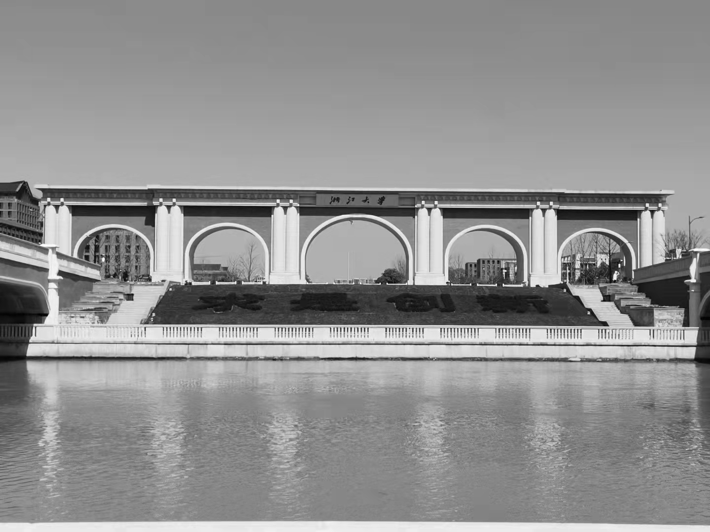
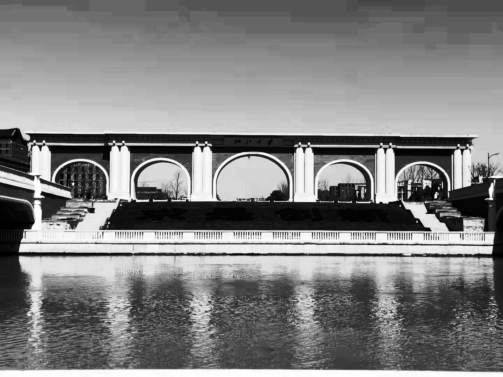
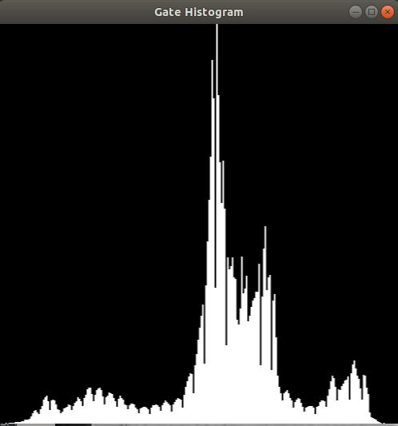
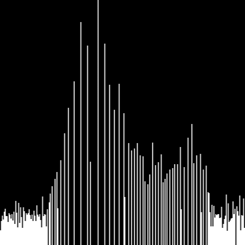
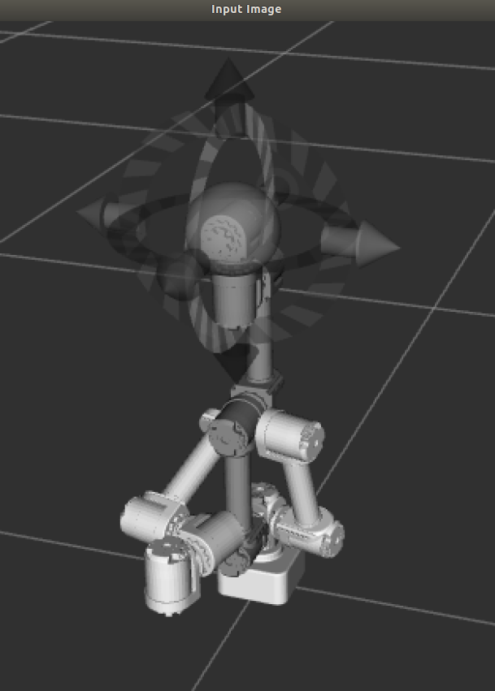
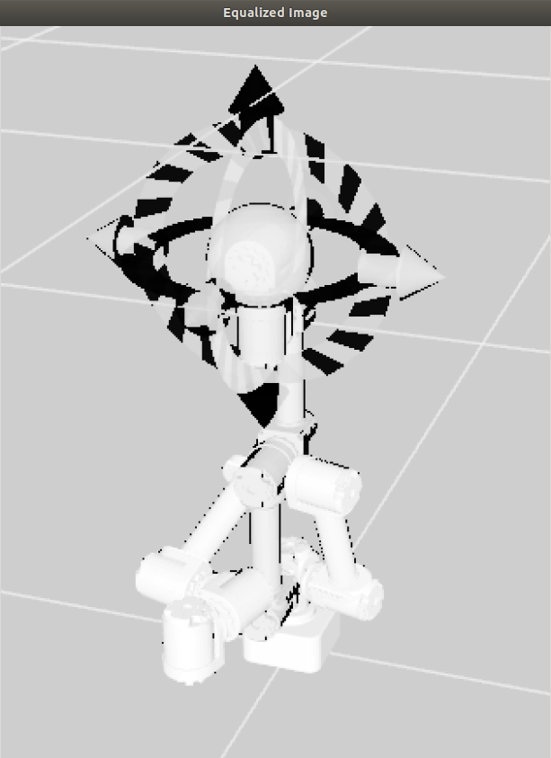
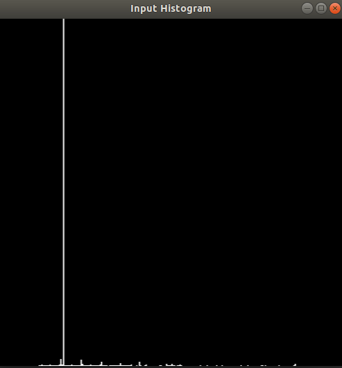
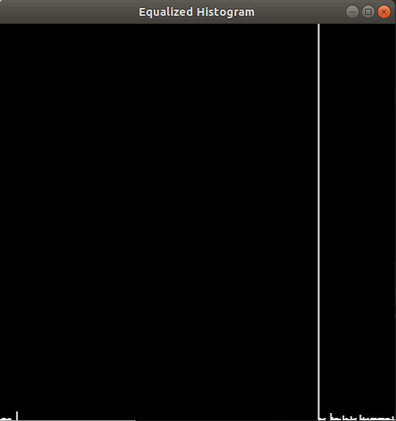

# 直方图均衡化

​	**姓名**： 胡天扬

​	**学号**： 3190105708

​	**专业**： 自动化（控制）

​	**课程**： 数字图像处理与机器视觉	

​	**指导教师**： 姜伟


## 一、题目要求

​		自选一张灰度图像，编程实现直方图均衡处理。

1. 基于累积分布函数实现直方图均衡部分需要自写代码。

2. 以实验报告形式提交结果，报告内容应包括自写源码、直方图均衡处理前后的图像和直方图。


## 二、直方图均衡化基本原理

​		直方图均衡化是一种简单有效的图像增强技术，通过改变图像的直方图来改变图像中各像素的灰度，主要用于增强动态范围偏小的图像的对比度。原始图像由于其灰度分布可能集中在较窄的区间，造成图像不够清晰。例如，过曝光图像的灰度级集中在高亮度范围内，而曝光不足将使图像灰度级集中在低亮度范围内。采用直方图均衡化，可以把原始图像的直方图变换为均匀分布的形式，这样就增加了像素之间灰度值差别的动态范围，从而达到增强图像整体对比度的效果。换言之，直方图均衡化的基本原理是：对在图像中像素个数多的灰度值（即对画面起主要作用的灰度值）进行展宽，而对像素个数少的灰度值（即对画面不起主要作用的灰度值）进行归并，从而增大对比度，使图像清晰，达到增强的目的。


## 三、直方图均衡化步骤

1. 计算各灰度级的像素个数。一张常规的`8bit`灰度图对应的灰度级是`0-255`，0对应黑色，255对应白色。
2. 计算总像素个数。本例中的`gate`图像的像素为`1080 x 1440`。
3. 计算灰度分布的概率密度函数。在离散情况下，用频率`pr`近似代替概率，即`各灰度级像素个数 / 总像素个数`。
4. 计算灰度累积分布函数。离散情况下为概率密度的和。
4. 将累积分布函数反变换。直方图均衡化的核心是获取变换函数，因此分布函数的取值范围要与原始图像的灰度级范围一致，由于灰度值都是整数，因此反变换的过程中需要取整。


## 四、程序说明

### 4.1 主函数

​		主函数中的逻辑很简单：读取图像–>显示原图–>均衡化–>显示均衡化后图像。内部操作封装在了`Equalization`类中。

```cpp
int main()
{
    // 读取图像
    cv::Mat gate = imread("../../image/gate.jpg", cv::IMREAD_GRAYSCALE);
    if (!gate.data)
    {
        std::cout << "Path error!" << std::endl;
        return -1;
    }

    // 显示原始图像和灰度图
    Equalization input(gate);
    input.showImage(input.image, "Gate Image");
    input.showImage(input.histogram, "Gate Histogram", cv::Size(500, 500), 0);

    // 对图像实施均衡化操作
    cv::Mat result = input.equalize();
    Equalization output(result);

    // 显示均衡化后的图像和灰度图
    output.showImage(output.image, "Equalized Image");
    output.showImage(output.histogram, "Equalized Histogram", cv::Size(500, 500), 0);

    return 0;
}
```

### 4.2 Equalization类

##### 4.2.1 cv::Mat Equalization::getHistMat(const cv::Mat & mat)

​        **计算并绘制图像的灰度直方图**。

​		首先用`opencv`内置函数`cv::calcHist`得到一个`dpi × 1`的`Mat`对象，由于均衡化时需要根据这个对象进行映射，因此将其保存为私有变量`hist_value`。

​		然后由`cv::minMaxLoc`得到`hist_value`中的最大值，即某一灰度值出现的最大次数，并根据灰度级256和最大次数创建一个`maxValue × 256`的全黑图像。

​		最后根据`hist_value`中每个幅度值的像素数量，用白色填充全黑图像得到直方图。由于`max_value`往往远大于256，因此需要将直方图`cv::resize`到合适的大小。

```cpp
cv::Mat Equalization::getHistMat(const cv::Mat & mat)
{
    // 获取灰度数据
    const int channels = 0;
    const int histSize = 256;
    float range[] = {0, 256};
    const float * ranges[] = {range};
    cv::calcHist(&mat, 1, &channels, cv::Mat(), hist_value, 1, &histSize, ranges, true, false);

    //　绘制原始图像的灰度直方图，背景为黑色，值为白色
    double maxValue = 0;
    cv::minMaxLoc(hist_value, nullptr, &maxValue, nullptr, nullptr);
    cv::Mat histGrey((int) maxValue, 256, CV_8UC1, cv::Scalar::all(0));
    for (int i = 0; i < 256; i++)
        histGrey.col(i).rowRange(cv::Range((int) maxValue - (int)hist_value.at<float>(i, 0), (int) maxValue)) = 255;

    //　调整灰度图的大小
    cv::Mat histResize;
    cv::resize(histGrey, histResize, cv::Size(500, 500));

    return histResize;
}
```

##### 4.2.2 cv::Mat Equalization::equalize()

​		**将直方图均衡化**。

​		计算归一化后的分布频率`pr`和累积分布率`sk`，将`sk`反归一化至`0-255`，从而得到映射函数。根据映射函数替换原始图像的像素值，得到均衡化后的图像。

```cpp
cv::Mat Equalization::equalize()
{
    // 计算概率分布密度和累计分布率
    double dpi = image.rows * image.cols;
    std::vector<double> pr(256, 0), sk(256, 0);
    for (int i = 0; i < 256; i++)
    {
        pr[i] = hist_value.at<float>(i, 0) / dpi;
        if (i == 0)
            sk[i] = pr[i];
        else
            sk[i] = sk[i-1] + pr[i];
    }

    // 反归一化得到映射函数
    for (int i = 0; i < 256; i++)
        sk[i] = int(sk[i] * 255 + 0.5);

    // 根据映射函数改变原始图像的像素值
    cv::Mat equalized_image = image;
    for (int i = 0; i < image.rows; i++)
        for (int j = 0; j < image.cols; j++)
            equalized_image.at<uchar>(i, j) = sk[(int)image.at<uchar>(i, j)];

    return equalized_image;
}
```


## 五、运行结果

### 5.1 灰度分布较为均衡的图像

#### 5.1.1 图像对比





#### 5.1.2 直方图对比

​                    

### 5.2 灰度分布不均的图像

#### 5.2.1 图像对比

​                                        

#### 5.2.2 直方图对比

​                    


## 六、总结

​		虽说直方图均衡化可以增强对比度，但同时也使得图像蕴含的信息减少。当原始图像的灰度分布比较均衡时，增强对比度的效果较好，只会损失小部分信息；而当原始图像本身的灰度值都集中在低灰度区时，根据均衡化公式的定义，由于低灰度区的频率很大，在计算分布函数时会使得后续的频率也增大，使得映射函数将其映射到高灰度区，图像也就会发白发亮，对于这种情况，其实更应该用**直方图规定化**来处理。