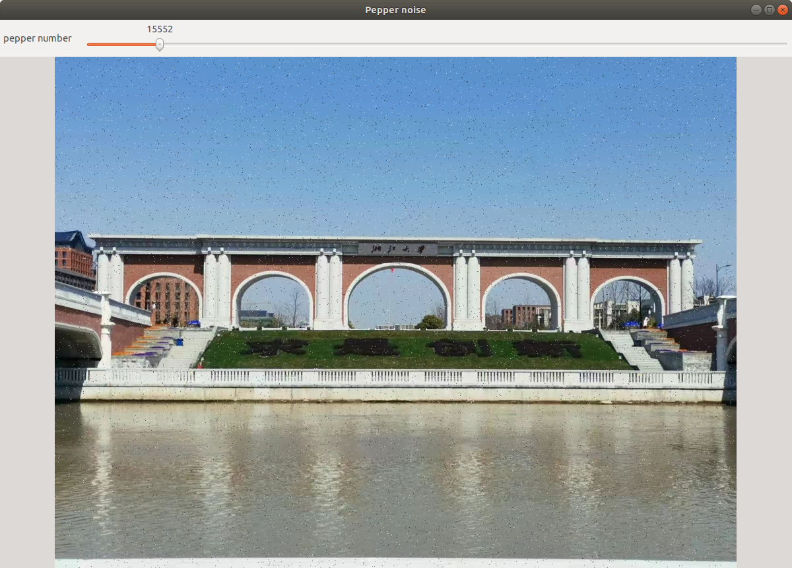
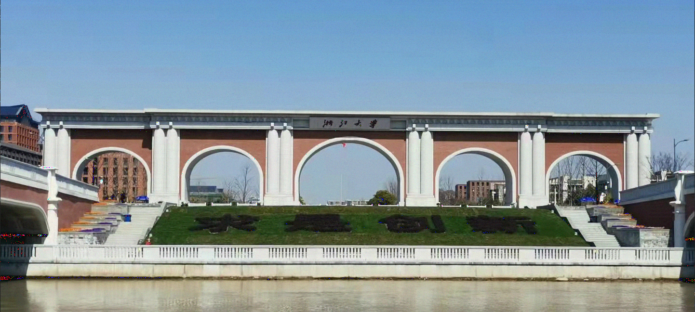
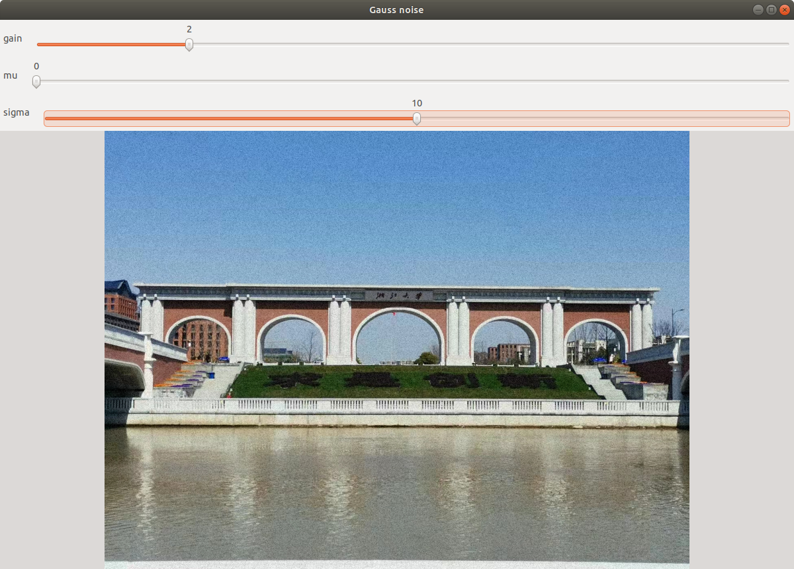
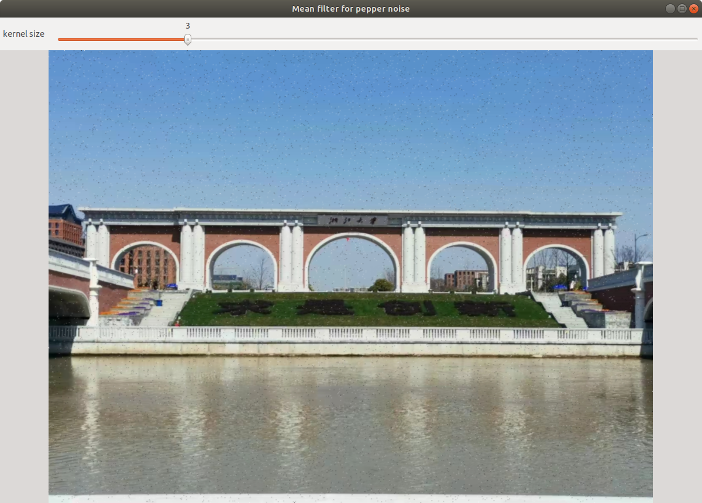
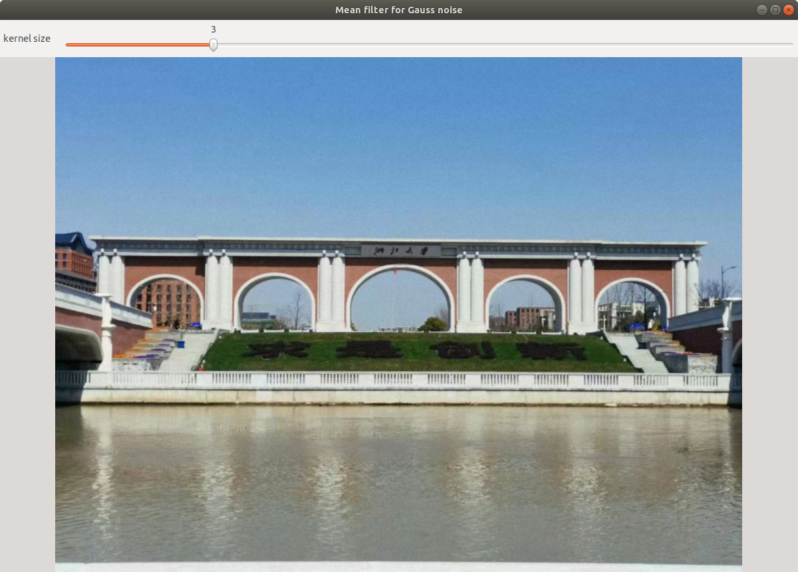
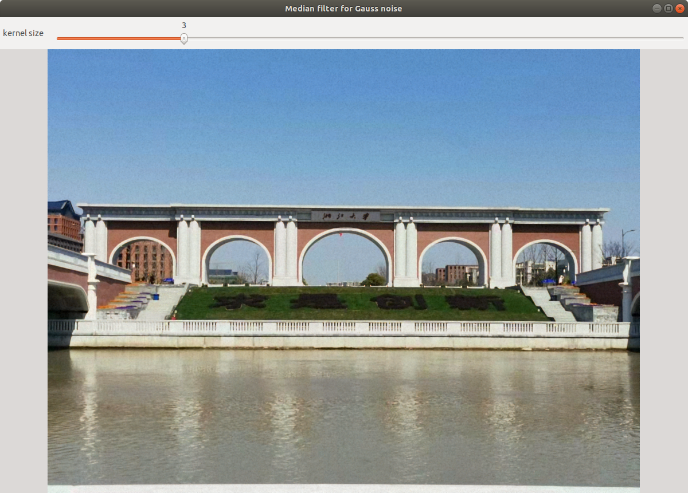
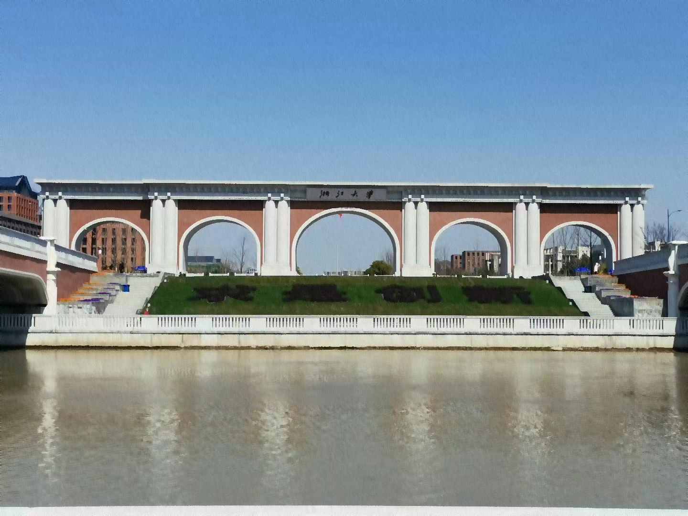
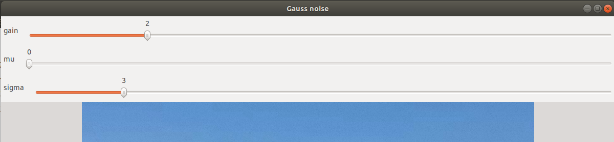

# 添加噪声并滤波

​	**姓名**： 胡天扬

​	**学号**： 3190105708

​	**专业**： 自动化（控制）

​	**课程**： 数字图像处理与机器视觉	

​	**指导教师**： 姜伟


## 一、题目要求

​		任意选取1张图像，添加高斯噪声和椒盐噪声。实现均值滤波、中值滤波和双边滤波等去噪方法，比较各方法去噪结果，并分析各去噪方法的特点。


## 二、原图

​		原图是一张三通道的彩色图，像素为`1080 × 1440`。


## 三、噪声

​		添加噪声的相关函数封装在了`Noise`类中。

### 3.1 椒盐噪声

​		椒盐噪声即黑色和白色的像素点。使用`rand()`函数随机选取像素点，并根据传入的噪声像素点数量`num_noise`分别添加黑点和白点。

```cpp
void Noise::addPepperNoise(const cv::Mat & src, cv::Mat & dst, int num_noise)
{
    dst = src.clone();

    // add black and white dot
    for (int i = 0; i < num_noise; i++)
    {
        int x = rand() % src.rows;
        int y = rand() % src.cols;
        if (i % 2 == 0)     // half for black
            for (int j = 0; j < 3; j++)
                dst.at<cv::Vec3b>(x, y)[j] = 0;
        else                // half for white
            for (int j = 0; j < 3; j++)
                dst.at<cv::Vec3b>(x, y)[j] = 255;
    }
}
```



### 3.2 高斯噪声

​		高斯分布的概率密度函数为 $p(z)=\frac{1}{\sqrt{2 \pi} \sigma} e^{-(z-\bar{z})^{2} / 2 \sigma^{2}}$，这里用 $Box-Muller$ 变换来构建服从高斯分布的随机变量。具体描述为：选取两个服从`[0, 1]`上均匀分布的随机变量 $U_1、U_2$，则有
$$
X=\cos \left(2 \pi U_{1}\right) \sqrt{-2 \ln U_{2}} \\
Y=\sin \left(2 \pi U_{1}\right) \sqrt{-2 \ln U_{2}}
$$
$X、Y$服从均值为0、方差为1的高斯分布。具体的数学证明就略过了。

​		代码如下，首先根据上述公式生成服从指定均值和方差的高斯分布序列，然后对每个像素点添加高斯噪声。

```cpp
double Noise::generateGaussSeq(double mu, double sigma) {
    // Box-Muller transform
    double u1, u2, std_norm_result;
    do {
        u1 = (double) rand() / RAND_MAX;
        u2 = (double) rand() / RAND_MAX;
        std_norm_result = cos(2 * CV_PI * u1) * sqrt(-2.0 * log(u2));
    } while (std_norm_result > 1.0 || std_norm_result == 0.0);
    return mu + sigma * std_norm_result;
}

void Noise::addGaussNoise(const cv::Mat & src, cv::Mat & dst, double gain, double mu, double sigma)
{
    dst = src.clone();

    int pixel_value;
    for (int i = 0; i < dst.rows; i++)
        for (int j = 0; j < dst.cols; j++)
        {
            pixel_value = gain * generateGaussSeq(mu, sigma);
            for (int channel = 0; channel < 3; channel++)
            {	
                // limit range to [0, 255]
                if (dst.at<cv::Vec3b>(i, j)[channel] + pixel_value > 255)
                    dst.at<cv::Vec3b>(i, j)[channel] = 255;
                else if (dst.at<cv::Vec3b>(i, j)[channel] + pixel_value < 0)
                    dst.at<cv::Vec3b>(i, j)[channel] = 0;
                else
                    dst.at<cv::Vec3b>(i, j)[channel] += pixel_value;
            }
        }
}
```

​		这里先前遇到了一个问题，生成的高斯噪声图片会产生彩色斑点（左下角和右下角），观察发现斑点全部都产生在原本的黑色或白色区域，且方差越大产生越多。经过研究，是因为生成的高斯噪声加入原图像后数值上超出了`[0, 255]`的范围，导致某一通道的像素值取摸赋值后产生两极突变，从而形成彩色斑点，因此在代码中加入了限制像素值上下限。

**修改前**



**修改后**




## 四、滤波

​		滤波的相关函数封装在了`Filter`类中。

### 4.1 均值滤波

​		均值滤波里面的种类也有很多，比如算术均值、几何均值、谐波均值、逆谐波均值，这里就用最常规的算术均值滤波，公式如下：
$$
f(x, y)=\frac{1}{m n} \sum_{(s, t) \in S_{x, y}} g(s, t)
$$
​		首先计算出待求像素到核边缘的距离`center2edge`，从而忽略边缘点的处理。为了代码的简洁考虑，在为`kernel`区域的像素值求和时，使用了`ROI`区域+`cv::sum()`的方法，可能时间复杂度会增加，但实际运行时没有影响。

```cpp
void Filter::meanFilter(const cv::Mat & src, cv::Mat & dst, int kernel_size)
{
    dst = src.clone();
    cv::Mat ROI;

    if (kernel_size % 2 == 0)
        kernel_size += 1;

    // ignore edge pixel
    if (kernel_size > 1)
    {
        int c2e = (int) (kernel_size / 2);  // center2edge
        for (int i = c2e; i < dst.rows - c2e; i++)
            for (int j = c2e; j < dst.cols - c2e; j++)
                for (int k = 0; k < 3; k++)
                {
                    // choose kernel area
                    ROI = dst(cv::Range(i - c2e, i + c2e + 1), cv::Range(j - c2e, j + c2e + 1));
                    // substitute for original pixel
                    dst.at<cv::Vec3b>(i, j)[k] = (int) cv::sum(ROI).val[k] / pow(kernel_size, 2);
                }
    }
}
```

**椒盐噪声均值滤波**



**高斯噪声均值滤波**



​		由于椒盐噪声的噪点像素值是0或255两个极值，因此使用均值滤波时，核半径越大黑白噪声越小，但是整体图片也越模糊。对高斯噪声而言，均值滤波的效果要比椒盐噪声好，因为添加高斯噪声时的均值为零，因此使用均值滤波后起到了复原的作用。

​		总体来看，均值滤波主要降低了图像的尖锐变化，去除了图像中的不相关细节，然而由于图像的边缘也是由图像灰度的尖锐变化带来的特性，所以均值滤波处理还是存在着边缘模糊的负面效应。

### 4.2 中值滤波

​		中值滤波就是把区域中的中值作为新的像素值，这部分代码略长，因为`opencv`中的排序函数`cv::sort()`只能针对行或列，不能同时针对整片区域，所以实际操作时先根据`kernel`取出`ROI`区域，`flatten`之后再交给`cv::sort`处理，但是有三点需要注意：

1. `cv::sort()`只能针对单通道，所以需要先拆分三通道。
2. `reshape()`只能针对连续值矩阵，而`ROI`恰好不是连续的，所以需要`clone()`出新的连续矩阵。
3. `cv::Mat`变量的定义要放在最外层循环外，否则会导致运行效率非常低。

```cpp
void Filter::medianFilter(const cv::Mat & src, cv::Mat & dst, int kernel_size)
{
    dst = src.clone();
    cv::Mat flattened, sorted, ROI, channels[3];

    // split channels
    cv::split(dst, channels);
    if (kernel_size % 2 == 0)
        kernel_size += 1;

    // ignore edge pixel
    if (kernel_size > 1)
    {
        int c2e = (int) (kernel_size / 2);  // center2edge
        for (int i = c2e; i < dst.rows - c2e; i++)
            for (int j = c2e; j < dst.cols - c2e; j++)
                for (int ch = 0; ch < 3; ch++)
                {
                    // choose kernel area
                    ROI = channels[ch](cv::Range(i - c2e, i + c2e + 1), cv::Range(j - c2e, j + c2e + 1));
                    // ROI region is not continuous, but 'reshape' requires continuous matrix
                    if (!ROI.isContinuous())
                        ROI = ROI.clone();
                    // flatten and sort
                    flattened = ROI.reshape(1, 1);
                    cv::sort(flattened, sorted, cv::SORT_EVERY_ROW + cv::SORT_ASCENDING);
                    // substitute for original pixel
                    dst.at<cv::Vec3b>(i, j)[ch]= sorted.at<cv::Vec3b>(0, c2e)[ch];
                }
    }
}
```

**椒盐噪声中值滤波**


**高斯噪声中值滤波**



​		中值滤波对椒盐噪声的效果极好，这一结论很容易从原理得出，由于代码没有处理边缘点，因此除了核半径的边缘图像，其余椒盐噪声被全部滤除。而对高斯噪声来说中值滤波的效果就有限。

​		总体来看，中值滤波对于滤除脉冲干扰及图像扫描噪声最为有效，不过中值滤波的窗口形状和尺寸对滤波效果影响很大，如果椒盐噪声的数量很多，就需要加大中值滤波的核半径。

### 4.3 双边滤波

​		双边滤波是是非线性滤波中的一种，其权重对高斯滤波的计算方法进行了优化，为**空间临近度计算的权值**和**像素值相似度计算的权值**的乘积，优化后的权值再与图像作卷积运算。因此在滤波时，该滤波方法同时考虑空间临近信息与颜色相似信息，在滤除噪声、平滑图像的同时，又做到边缘保存。

​		每个像素点的计算公式为：
$$
\mathrm{g}(\mathrm{i}, \mathrm{j})=\frac{\sum_{(k, l) \in S(i, j)} f(k, l) w(i, j, k, l)}{\sum_{(k, l) \in S(i, j)} w(i, j, k, l)}
$$
其中，g(i, j) 代表输出点像素；S(i, j) 代表以 (i, j) 为中心的邻域；f(k, l) 代表输入点像素；w(i, j, k, l) 代表权重，而权重又取决于定义域核和值域核。

​		定义域核：
$$
d(i, j, k, l)=\exp \left(-\frac{(i-k)^{2}+(j-l)^{2}}{2 \sigma_{d}^{2}}\right)
$$
​		值域核：
$$
r(i, j, k, l)=\exp \left(-\frac{\|f(i, j)-f(k, l)\|^{2}}{2 \sigma_{r}^{2}}\right)
$$
​		权重：
$$
w(i, j, k, l)=\exp \left(-\frac{(i-k)^{2}+(j-l)^{2}}{2 \sigma_{d}^{2}}-\frac{\|f(i, j)-f(k, l)\|^{2}}{2 \sigma_{r}^{2}}\right)
$$
​		在编程时严格对应了以上符号。同时，定义域核的权重仅与核半径相关，与邻域像素值无关，因此可以提前计算，提高运行效率。

```cpp
void Filter::bilateralFilter(const cv::Mat & src, cv::Mat & dst, int kernel_size, double sigma_domain, double sigma_range)
{
    using namespace std;
    dst = src.clone();

    double weight_domain[kernel_size][kernel_size], weight_range[kernel_size][kernel_size];
    if (kernel_size % 2 == 0)
        kernel_size += 1;
    // center pixel point index 'i' & 'j'
    int i = (int) kernel_size / 2, j = i;
    // surrounding pixel point index 'k' & 'l'
    int k, l;

    // calculate domain kernel, only up to kernel size
    for (k = 0; k < kernel_size; k++)
        for (l = 0; l < kernel_size; l++)
            weight_domain[k][l] = exp(-(pow(i-k,2) + pow(j-l,2)) / (2 * pow(sigma_domain, 2)));

    // change pixel value
    if (kernel_size > 1)
    {
        double sum_numerator = 0, sum_denominator = 0;
        int c2e = (int) (kernel_size / 2);  // center2edge
        for (i = c2e; i < dst.rows - c2e; i++)
            for (j = c2e; j < dst.cols - c2e; j++)
            {
                for (int ch = 0; ch < 3; ch++)
                {
                    // calculate range kernel
                    for (k = 0; k < kernel_size; k++)
                        for (l = 0; l < kernel_size; l++)
                        {
                            weight_domain[k][l] =
                                    exp(-pow(src.at<cv::Vec3b>(i, j)[ch] -
                                            src.at<cv::Vec3b>(i-c2e+k, j-c2e+l)[ch], 2)
                                    / (2 * pow(sigma_range, 2)));
                        }
                    for (k = 0; k < kernel_size; k++)
                        for (l = 0; l < kernel_size; l++)
                        {
                            sum_numerator += src.at<cv::Vec3b>(i-c2e+k, j-c2e+l)[ch] *
                                    weight_domain[k][l] * weight_range[k][l];
                            sum_denominator += weight_domain[k][l] * weight_range[k][l];
                        }
                    dst.at<cv::Vec3b>(i, j)[ch] = sum_numerator / sum_denominator;
                    sum_numerator = sum_denominator = 0;
                 }
            }
    }
}
```

**椒盐噪声双边滤波**


**高斯噪声双边滤波**



​		双边滤波对椒盐噪声的效果不如中值滤波，但优于均值滤波。而双边滤波本身就是由高斯滤波衍化而来，因此对高斯噪声的效果比前两个滤波器更好。

​		本质上来说，双边滤波同时考虑了邻域像素间的距离和相似度，相比于普通的低通滤波器，双边滤波可以在保留边缘信息的同时滤除噪声，所以滤波后的效果类似于，区分了像素值差别大的区域，同时模糊了区域内的图像。


## 五、程序架构

### 5.1 滑动条

​		由于椒盐噪声的像素个数、高斯噪声的方差、滤波的核半径等都是可调变量，因此使用滑动条来增加手动调整的功能。该函数可以在指定窗口上方添加滑杆，并在滑杆改变时调用回调函数，呈现不同参数的图片。

​		**注意**：**拖动滑杆改变核半径进行滤波时会卡，加载双边滤波的图像时也会卡，请耐心等待。**

```cpp
int createTrackbar(const String& trackbarname, const String& winname,
                              int* value, int count,
                              TrackbarCallback onChange = 0,
                              void* userdata = 0);
```



### 5.2 避免全局变量

​		一般添加滑杆后都是通过设置全局变量来供回调函数内部使用，但是本程序如果使用全局变量会非常冗长（代码很丑），查看手册后得知，回调函数的第二个参数是通过创建滑杆的最后一个参数传递的，但这是一个`void*`指针，如果只传一个`cv::Mat*`指针的话，会由于上层函数中变量作用域的问题，导致传入回调函数中的指针指向不存在的内存空间。因此最后是通过打包成一个类传递的方式实现的，将参数封装在`Data`类中，然后内层再提取出来使用。

```cpp
void on_Trackbar(int pos, void *);
```

```cpp
class Filter {
public:
    class Data
    {
    public:
        cv::Mat src;
        std::string win_name;
    };
}
```

### 5.3 函数指针

​		由于不同图片的滑杆需求不一致，但同时又考虑到代码的简洁性，因此使用函数指针的方式对不同图片创建滑杆，主要要把类中的回调函数声明为静态函数，否则在主函数中调用时会因为`this`指针失去上下文而报错。

```cpp
void showImage(cv::Mat & mat, 
               const std::string & win_name, 
               cv::Size size, 
               int wait_key=0, 
               const std::string & save_path="", 
               void (*pTrackbar)(cv::Mat & src, const std::string & win_name)=nullptr);
```

​		例如，对于添加椒盐噪声，函数指针和回调函数分别如下：

```cpp
Noise::Data pepper_data;
void Noise::pepperTrackbar(cv::Mat & src, const std::string & win_name)
{
    pepper_data.src = src;
    pepper_data.win_name = win_name;
    int max_pos = src.cols * src.rows / 10;
    int cur_pos = src.cols * src.rows / 100;
    cv::createTrackbar("pepper number", win_name, nullptr, max_pos,
                       pepperCallback, (void*)& pepper_data);
    cv::setTrackbarPos("pepper number", win_name, cur_pos);
}

void Noise::pepperCallback(int pepper_num, void * data)
{
    Data* extracted_data = (Data*) data;
    cv::Mat dst, src = extracted_data->src;
    std::string win_name = extracted_data->win_name;

    Noise noise;
    noise.addPepperNoise(src, dst, pepper_num);
    cv::imshow(win_name, dst);
}
```

### 5.4 不足

​		程序不够完善的地方是运行效率，尤其是双边滤波，需要十几秒的时间才能运行完，这是因为在计算像素时没有做并行处理，导致时间复杂度与像素个数和卷积核半径呈指数级相关。这也是没有在双边函数输出图像上添加滑杆的原因，会直接卡死。


## 六、总结

​		本次作业的主要难点并不在于噪声和滤波器的实现，而在于整体的代码框架，如何通过函数指针、回调函数等方式来合理调用不同的滤波器，最终的效果符合预期结论，但是感觉这张图选的不是很好，对双边滤波而言没有展现得特别清晰。