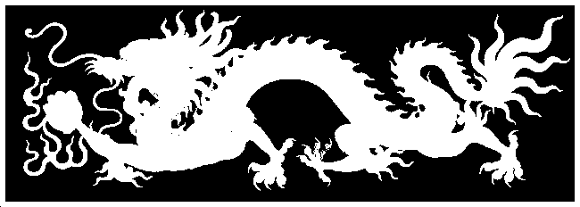
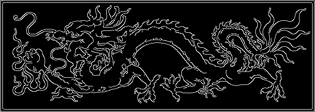
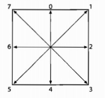
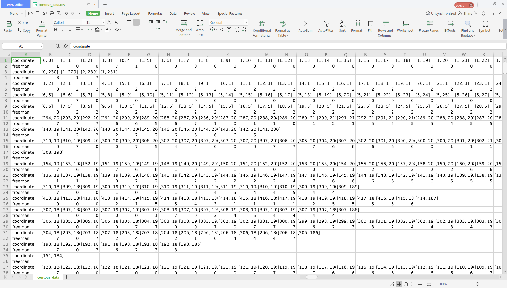

# 图像分割

​	**姓名**： 胡天扬

​	**学号**： 3190105708

​	**专业**： 自动化（控制）

​	**课程**： 数字图像处理与机器视觉	

​	**指导教师**： 姜伟


## 一、题目要求

​		自选一张内容简单的灰度图像，用一种方法实现图像前景、背景分割，并提取前景区域边缘。给出灰度图像、分割后二值化图像、边缘提取结果图像，以及边缘的链码表示。


## 二、原图

​		原图是一张单通道的灰度图，像素为`232 x 650`。


## 三、大津法二值化

​		调用内置函数`cv::threshold`，配合可选参数可以实现不同的二值化方法，这里用了大津法（OTSU）。

```cpp
double cv::threshold(
	cv::InputArray src,
	cv::OutputArray dst, 
	double thresh, 
	double maxValue,
	int thresholdType
);
```

**main.cpp**

```cpp
cv::Mat bin_image;
cv::threshold(input_image, bin_image, 0, 255, cv::THRESH_BINARY | cv::THRESH_OTSU);
showImage(bin_image, "Binary image", image_size, 0, "../../result/bin_image.png");
```




## 四、Canny边缘检测

​		与上次滤波一样，用函数指针来加入滑杆，分别调节Canny算法的两个阈值。

**main.cpp**

```cpp
showImage(input_image, "Edge image", image_size, 0, "", Segment::cannyTrackbar);
```

**Segment.cpp**

```cpp
void Segment::cannyTrackbar(cv::Mat &src, const std::string &win_name)
{
    canny_data.src = src;
    canny_data.win_name = win_name;
    cv::createTrackbar("threshold 1", "Edge image", nullptr, 255,
                       cannyLowThrCallback, (void*)& canny_data);
    cv::createTrackbar("threshold 2", "Edge image", nullptr, 255,
                       cannyHighThrCallback, (void*)& canny_data);
}

void Segment::cannyLowThrCallback(int low_threshold, void *data)
{
    cv::Mat dst;
    cv::Canny(canny_data.src, dst, low_threshold, canny_data.high_threshold);
    canny_data.low_threshold = low_threshold;
    cv::imshow(canny_data.win_name, dst);
}

void Segment::cannyHighThrCallback(int high_threshold, void *data)
{
    cv::Mat dst;
    cv::Canny(canny_data.src, dst, canny_data.low_threshold, high_threshold);
    canny_data.high_threshold = high_threshold;
    cv::imshow(canny_data.win_name, dst);
}
```




## 五、边界链码

### 5.1 获取二值化图像的边界链码

​		这里使用内置函数`cv::findContours`获取链码。

```cpp
void cv::findContours(
    cv::InputOutputArray image,
    cv::OutputArrayOfArrays contours,	// type --- std::vector<std::vector<cv::Point>>
    cv::OutputArray hierarchy,			// type --- std::vector<cv::Vec4i>
    int mode,
    int method,
    cv::Point offset = cv::Point()
);
```

​		其中`mode`表示轮廓提取的方式，可选参数如下，这里选用`cv::RETR_TREE`。

| 参数                | 含义                                                         |
| ------------------- | ------------------------------------------------------------ |
| `cv::RETR_EXTERNAL` | 只提取最外面的轮廓                                           |
| `cv::RETR_LIST`     | 提取所有轮廓并将其放入列表                                   |
| `cv::RETR_CCOMP`    | 提取所有轮廓并将组织成一个两层结构，顶层为外部轮廓，第二层为hole的轮廓 |
| `cv::RETR_TREE`     | 提取所有轮廓并组织成轮廓嵌套的完整层级结构                   |

​		`method`表示轮廓展现的方法，可选参数如下，这里选用`cv::CHAIN_APPROX_SIMPLE`。

| 参数                       | 含义                                         |
| -------------------------- | -------------------------------------------- |
| `cv::CHAIN_APPROX_NONE`    | 将轮廓中的所有点的编码转换成点               |
| `cv::CHAIN_APPROX_SIMPLE`  | 压缩水平、垂直和对角直线段，仅保留它们的端点 |
| `cv::CHAIN_APPROX_TC89_L1` | 应用 $Teh-Chin$ 链近似算法中的一种风格       |

### 5.2 绘制获取的轮廓图像

​		这里使用内置函数`cv::drawCountours`

```cpp
void cv::drawContours(
	cv::InputOutputArray image, 		// 用于绘制的输入图像
	cv::InputArrayOfArrays contours, 	// 点的vectors的vector
	int contourIdx, 					// 需要绘制的轮廓的指数 (-1 表示 "all")
	const cv::Scalar& color, 			// 轮廓的颜色
	int thickness = 1,
	int lineType = 8, 
	cv::InputArray hierarchy = noArray(), 
	int maxLevel = INT_MAX,
	cv::Point offset = cv::Point()
）
```

**main.cpp**

```cpp
// contour
std::vector<std::vector<cv::Point>> contours;
std::vector<cv::Vec4i> hierarchy;
cv::findContours(edge_image, contours, hierarchy, cv::RETR_TREE, cv::CHAIN_APPROX_SIMPLE);
cv::Mat contour_image = cv::Mat::zeros(input_image.rows, input_image.cols, CV_8UC3);
cv::drawContours(contour_image, contours, -1, cv::Scalar(100, 100, 100));
showImage(contour_image, "Contour image", image_size, 0, "../../result/contour_image.png");
```


### 5.3 获取链码并写入文件

​		`contour`的变量类型为`std::vector<std::vector<cv::Point>>`，使用`STL`容器的特性进行遍历，并结合`csv`以逗号分割的特点，将坐标点写入`contour_data.csv`中，每一行为一个特定的轮廓，每一格为特定轮廓上的一个点。

​		为获取`freeman`链码，判断前后两点的位置关系，以下图形式确定编号，写在文件中`contour`坐标点的下一行，因此用两行分别表示一个轮廓的坐标和链码。



```cpp
// get freeman code and write to file
std::vector<int> freeman_code;
Segment segment;
std::ofstream outfile;
outfile.open("../../result/contour_data.csv", std::ios::out);
for (const auto & contour : contours)
{
    segment.getFreeman(contour, freeman_code);
    outfile << "coordinate,";
    for (auto point : contour)
    {
        outfile << "\"" << point << "\",";
    }
    outfile << std::endl;
    outfile << "freeman,";
    for (auto code : freeman_code)
    {
        outfile << code << ",";
    }
    outfile << std::endl;
    freeman_code.clear();
}
```




## 六、总结

​		本次作业要求实现前景背景的分割和轮廓提取等功能，分别用了大津法和Canny算子，因为它们实在太有名了。不过这张图的背景是全黑图像，本身区分就很明显，所以效果很好，如果把Canny的阈值调小则会产生更多轮廓边界。另外由于最近考试周太忙了所以除了链码部分都调用了内置函数。