# 形态学滤波与图像细化

​	**姓名**： 胡天扬

​	**学号**： 3190105708

​	**专业**： 自动化（控制）

​	**课程**： 数字图像处理与机器视觉	

​	**指导教师**： 姜伟


## 一、题目要求

​		自选一幅灰度图像（最好是数字、文字图像，或具有细线条的图像），编程实现一下功能：

​		（1）选用一种图像二值化方法，实现图像二值化，提取前景目标；

​		（2）基于二值形态学滤波方法，二值化结果进行形态学滤波，实现小尺度噪点去除和孔洞填充；

​		（3）实践一种图像细化算法，实现前景目标细化。


## 二、原图

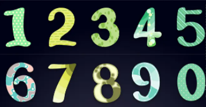

​		一张彩色数字的图像，从 $0$ 到 $9$ 共10个数字。图像尺寸为`183 x 353`。


## 三、大津法二值化

### 3.1 原理

​		大津法又叫最大类间方差法，是于1979年由日本学者大津展之提出的一种对图像进行二值化的高效算法，是在判别与最小二乘法原理的基础上推导出来的。

​		设灰度值为 $i$ 的像素个数为 $x_i$，则像素总数为 $N=\sum_{i=0}^n x_i$，各灰度级的概率为 $p_i=\dfrac{n_i}{N}$，对于某一个阈值 $T$，我们可以将灰度级分为两组 $C_0=\{t|0\to T\},~C_1\{t|T+1\to255\}$，则 $C_0$ 的概率为 $w_0=\sum_{i=0}^T p_i$，均值为 $\mu_0=\sum_{i=0}^T \dfrac{i*p_i}{w_0}$，$C_1$ 的概率为 $w_1=\sum_{T+1}^{255} p_i$，均值为 $\mu_1=\sum_{T+1}^{255} \dfrac{i*p_i}{w_1}$，总均值为 $\mu=w_0\mu_0+w_1\mu_1$，最终需要最大化的方差为：
$$
\delta ^ { 2 } = w _ { 0 } ( \mu _ { 0 } - \mu ) ^ { 2 } + w _ { 1 } ( \mu _ { 1 } - \mu ) ^ { 2 } = w _ { 0 } w _ { 1 } ( \mu _ { 1 } - \mu _ { 0 } ) ^ { 2 }
$$
​		获取了阈值后，将小于阈值的像素值置为0，大于阈值的像素值置为255。

### 3.2 代码

​		变量命名与上述公式一致。

```c++
void Morphology::OSTU(const cv::Mat & src, cv::Mat & dst)
{
    dst = src.clone();

    // calculate probability of each grey value
    int size = src.cols * src.rows;
    double p[256] = {0};
    for (int i = 0; i < src.rows; i++) {
        auto row_ptr = src.ptr<uchar>(i);
        for (int j = 0; j < src.cols; j++)
            p[row_ptr[j]] += 1.0;
    }
    for (double & i : p)
        i /= size;

    // calculate threshold according to formula of OSTU
    int threshold;
    double max_delta = 0, cur_delta;
    for (int i = 0; i < 256; i++)
    {
        double w0 = 0, w1 = 0, mu0 = 0, mu1 = 0;
        for (int j = 0; j < i; j++)
            w0 += p[j];
        w1 = 1 - w0;
        for (int j = 0; j < 256; j++)
            if (j < i)
                mu0 += p[j] * (j+1) / w0;
            else
                mu1 += p[j] * (j+1) / w1;
        cur_delta = w0 * w1 * pow(mu1-mu0, 2);
        if (cur_delta > max_delta)
        {
            max_delta = cur_delta;
            threshold = i;
        }
    }
    std::cout << "OSTU threshold: " << threshold << std::endl;

    // binarize the images
    for (int i = 0; i < dst.rows; i++)
    {
        auto row_ptr = dst.ptr<uchar>(i);
        for (int j = 0; j < dst.cols; j++)
            row_ptr[j] = ((row_ptr[j] < threshold) ? 0 : 255);
    }
}
```

### 3.3 运行结果

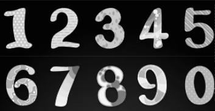

<center>灰度图像</center>


<center>大津法二值化后图像</center>


## 四、腐蚀

### 4.1 原理

​		腐蚀是缩小图像，去除小沟壑细节的一种操作，其实质造成图像的边界收缩，可以用来消除小且无意义的目标物，表达式为：
$$
H \odot B \, = \, \{ x , Y \, | ( B ) _ { _ { \chi } } \in A \}
$$
​		该式子表示用结构B腐蚀A，需要注意的是B中需要定义一个原点，B的移动的过程与卷积核移动的过程一致，同卷积核与图像有重叠之后再计算一样。当B的原点平移到图像A的像元 (x, y) 时，如果B完全被包含在图像A重叠的区域，也就是B中为1的元素位置上对应的A图像值全部也为1，则将输出图像对应的像元 (x,y) 赋值为1，否则赋值为0。

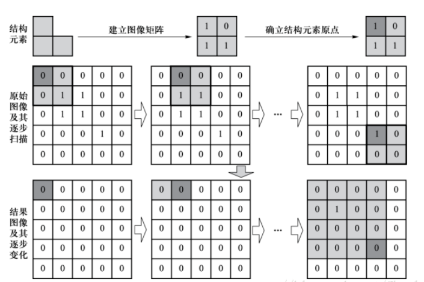

### 4.2 代码

​		这里腐蚀结构B选择为规则的正方形，核半径作为参数传入。

```c++
void Morphology::erode(const cv::Mat & src, cv::Mat & dst, int kernel_size)
{
    dst = cv::Mat::zeros(src.size(), src.type());
    int c2e = (int) (kernel_size / 2);    // distance of kernel center to edge

    // traverse points on input images
    for (int i = c2e; i < src.rows - c2e; i++)
        for (int j = c2e; j < src.cols - c2e; j++)
        {
            // extract ROI
            int flag = 0;   // flag == 1 means erosion
            // traverse points on kernel
            for (int x = -c2e; x < c2e; x++)
            {
                for (int y = -c2e; y < c2e; y++)
                    if (src.at<uchar>(i+x, j+y) == 0)
                    {
                        flag = 1;
                        break;
                    }
                if (flag)
                    break;
            }
            dst.at<uchar>(i, j) = (flag ? 0 : 255);
        }
c}
```

### 4.3 运行结果


<center>二值化图像</center>


<center>腐蚀后图像</center>

​		可以看到边缘细小毛刺被去除，但也导致内部孔洞被放大。


## 五、膨胀

### 5.1 原理

​		膨胀会使目标区域范围“变大”，将于目标区域接触的背景点合并到该目标物中，使目标边界向外部扩张，作用就是可以用来填补目标区域中某些空洞以及消除包含在目标区域中的小颗粒噪声。
$$
A \oplus B=\left\{x, y \mid(B)_{x v} \cap A \neq \varnothing\right\}
$$
​		该式子表示用结构B膨胀A，将结构元素B的原点平移到图像像元 (x,y) 位置。如果B在图像像元 (x,y) 处与A的交集不为空，也就是B中为1的元素位置上对应A的图像值至少有一个为1，则输出图像对应的像元 (x,y) 赋值为1，否则赋值为0。

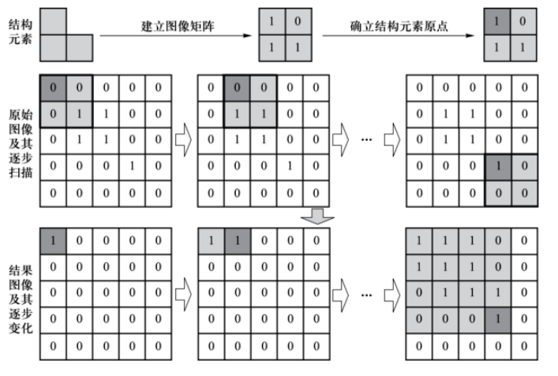

### 5.2 代码

```c++
void Morphology::dilate(const cv::Mat &src, cv::Mat &dst, int kernel_size)
{
    dst = cv::Mat::zeros(src.size(), src.type());
    int c2e = (int) (kernel_size / 2);    // distance of kernel center to edge

    // traverse points on input images
    for (int i = c2e; i < src.rows - c2e; i++)
        for (int j = c2e; j < src.cols - c2e; j++)
            if (src.at<uchar>(i, j) == 255)
                // traverse points on kernel
                for (int x = -c2e; x < c2e; x++)
                    for (int y = -c2e; y < c2e; y++)
                        dst.at<uchar>(i+x, j+y) = 255;
}
```

### 5.3 运行结果


<center>二值化图像</center>

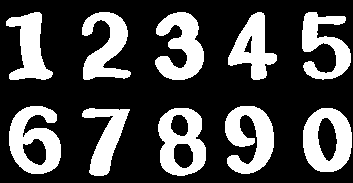

<center>膨胀后图像</center>

​		可以看到内部孔洞被填充，整体更为饱满。


## 六、开运算

### 6.1 原理

​		开运算即先腐蚀运算，再膨胀运算，能够除去孤立的小点，毛刺和小桥，把细微连在一起的两块目标分开。且不同的结构元素的选择导致了不同的分割，即提取出不同的特征。

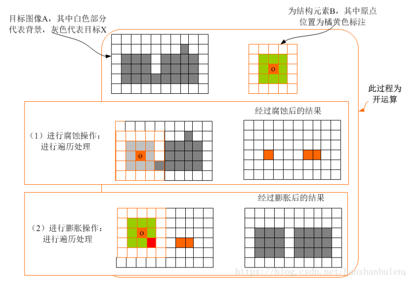

### 6.2 代码

```c++
void Morphology::open(cv::Mat &src, cv::Mat &dst, int erode_size, int dilate_size)
{
    cv::Mat erode_output;
    erode(src, erode_output, erode_size);
    dilate(erode_output, dst, dilate_size);
}
```

### 6.3 运行结果


<center>二值化图像</center>


<center>开运算后图像</center>

​		可以看到边缘噪点被去除，边缘变得更为平滑，同时图像内部的孔洞比单纯的腐蚀运算更小，效果更好。


## 七、闭运算

### 7.1 原理

​		闭运算即先膨胀运算，再腐蚀运算，能够填平小孔，弥合小裂缝，把两个细微连接的图块封闭在一起，通过填充图像的凹角来滤波图像。

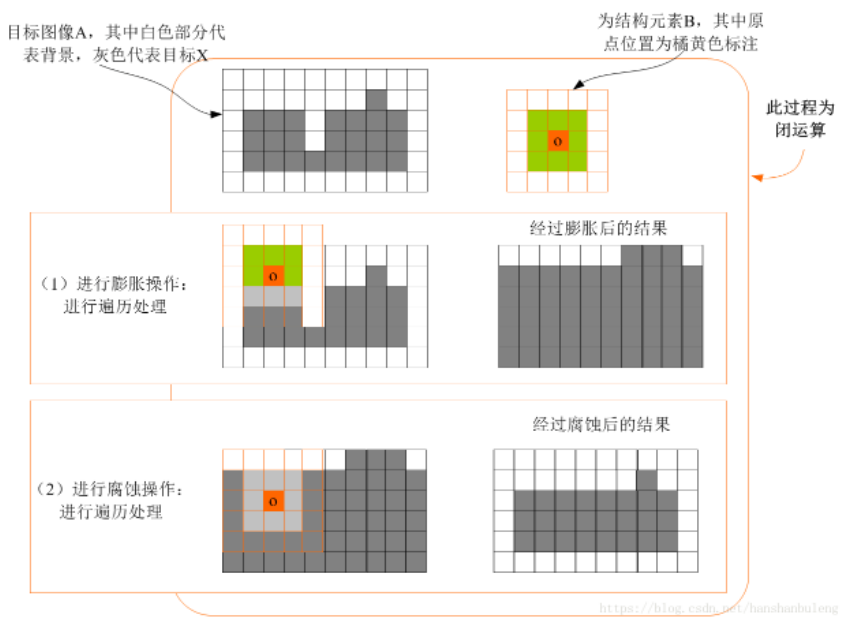

### 7.2 代码

```c++
void Morphology::close(cv::Mat &src, cv::Mat &dst, int erode_size, int dilate_size)
{
    cv::Mat dilate_output;
    dilate(src, dilate_output, dilate_size);
    erode(dilate_output, dst, erode_size);
}
```

### 7.3 运行结果

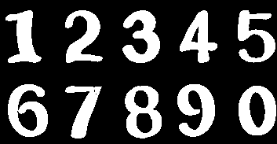

<center>二值化图像</center>


<center>闭运算后图像</center>

​		可以看到内部孔洞被完全填平，同时边缘的毛刺比单纯的膨胀运算要小，效果更好。


## 八、击中击不中变换

### 8.1 原理

​		击中击不中变换 $(Hit~or~Miss~Transform,~HMT)$ 是形态学形状检测的基本工具，是用来查找像素局部模式的形态学运算符。对于两个不相交集合 $B={B_1,~B_2}$，称 $B$ 为复合结构元素。则击中击不中变换为：
$$
X \otimes B=\left\{x: B_{1} \subset X \text { 且 } B_{2} \subset X^{C}\right\}
$$
​		即用 $B_1$ 去腐蚀 $X$，然后用 $B_2$ 去腐蚀 $X$ 的补集，得到的结果相减就是击中击不中变换。

​		$HMT$ 只能作用于二值图像，结构元（核）元素值由0、1、-1组成。操作时，结构元在图像上滑动，覆盖一小片与核大小一样的区域，然后逐一对比，核的值为1时，覆盖区域对应位置必须为255，而核值为-1时，则必须为0，核值为0时对应像素为0和255均可，如果覆盖区域所有的位置均满足上述要求，则表示击中，锚点位置设置为255，如果有任意一个位置不满足，则表示击不中，锚点位置设置为0。

​		对于骨架细化而言，就是利用经验上的一组结构元，不断循环重复的进行 $HMT$ 变换，直至结果收敛（不在变换）。单次细化公式定义为：
$$
A \otimes B=A-(A \circledast B)=A \cap(A \circledast B)^{c}
$$
其中 $A$ 为源图像，$B$ 为结构元，$\{B\}=\left\{B^{1}, B^{2}, B^{3}, \cdots, B^{n}\right\}$，依据这一结构元序列将细化定义为：
$$
A \otimes\{B\}=\left(\left(\cdots\left(\left(A \otimes B^{1}\right) \otimes B^{2}\right) \cdots\right) \otimes B^{n}\right)
$$
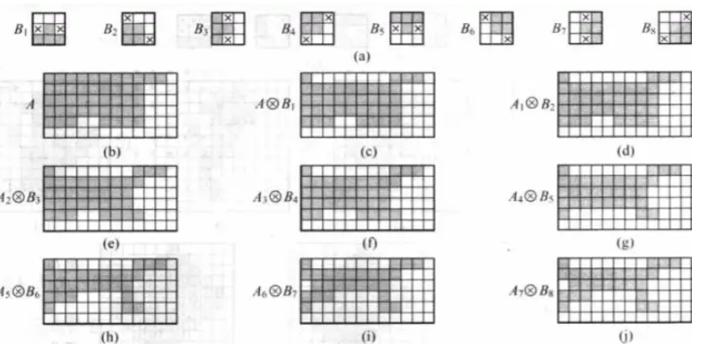

### 8.2 代码

​		选取设置最大迭代上限为100次。选择常用的一组结构元序列。

```c++
class Morphology {
private:
    int max_iter = 100;
    std::vector< std::vector< std::vector<int> > > HMT_kernel = {
        {{-1,-1,-1}, {0,1,0}, {1,1,1}},
        {{0,-1,-1}, {1,1,-1}, {1,1,0}},
        {{1,0,-1}, {1,1,-1}, {1,0,-1}},
        {{1,1,0}, {1,1,-1}, {0,-1,-1}},
        {{1,1,1}, {0,1,0}, {-1,-1,-1}},
        {{0,1,1}, {-1,1,1}, {-1,-1,0}},
        {{-1,0,1}, {-1,1,1}, {-1,0,1}},
        {{-1,-1,0}, {-1,1,1}, {0,1,1}},
    };
```

```c++
void Morphology::HMT(const cv::Mat &src, cv::Mat &dst)
{
    int kernel_size = (int) HMT_kernel[0][0].size();
    int c2e = (int) (kernel_size / 2);    // distance of kernel center to edge

    cv::Mat input = src.clone(), output = src.clone();
    cv::Mat roi = cv::Mat::zeros(cv::Size(kernel_size, kernel_size), src.type());

    int iter = 0;
    while (true)
    {
        // traverse templates to HMT
        for (auto kernel : HMT_kernel)
        {
            std::vector<cv::Point> points;  // points failed to hit
            // traverse points on input images
            for (int i = 0; i < input.rows - 2*c2e; i++)
                for (int j = 0; j < input.cols - 2*c2e; j++)
                {
                    bool flag = true;
                    // traverse points on kernel
                    for (int x = 0; x < kernel_size; x++)
                        for (int y = 0; y < kernel_size; y++)
                            if ((kernel[x][y] == 1 && input.at<uchar>(i+x, j+y) == 0) ||
                                (kernel[x][y] == -1 && input.at<uchar>(i+x, j+y) == 255))
                                flag = false;
                    if (flag)
                        points.emplace_back(i+1, j+1);
                }
            for (auto point : points)
                output.at<uchar>(point.x, point.y) = 0;
        }

        iter++;
        // conditions on termination
        if ((iter >= max_iter) || (cv::countNonZero((output != input)) == 0))
        {
            dst = output.clone();
            std::cout << "HTM iter times: " << iter << std::endl;
            break;
        }
        input = output.clone();
    }
}
```

### 8.3 运行结果


<center>二值化图像</center>

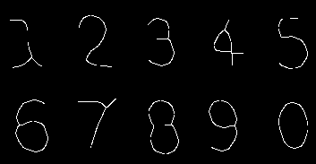

<center>骨架细化后图像</center>


## 九、其他

### 9.1 主函数

```c++
int main(int argc, char* argv[])
{
    // read images
    boost::format read_fmt("../../images/%s.%s");
    boost::format save_fmt("../../images/%s_%s.png");
    std::string image_name, image_type;
    if (argc == 2)
    {
        image_name = argv[1];
        image_type = "png";
    }
    if (argc == 3)
    {
        image_name = argv[1];
        image_type = argv[2];
    }
    else
    {
        image_name = "dragon";
        image_type = "jpeg";
    }

    cv::Mat input_image = cv::imread((read_fmt % image_name % image_type).str(), cv::IMREAD_GRAYSCALE);
    if (!input_image.data)
    {
        std::cout << "Path error!" << std::endl;
        return -1;
    }
    else
        std::cout << "image size: " << input_image.size << std::endl;

    cv::Size image_size(1000, 400);
    showImage(input_image, "input images", image_size, 0, (save_fmt % image_name % "grey").str());

    Morphology morphology;
    // OSTU
    cv::Mat binary_image;
    morphology.OSTU(input_image, binary_image);
    showImage(binary_image, "binary images", image_size, 0, (save_fmt % image_name % "binary").str());

    // erosion
    cv::Mat erode_image;
    morphology.erode(binary_image, erode_image);
    showImage(erode_image, "erode images", image_size, 0, (save_fmt % image_name % "erode").str());

    // dilation
    cv::Mat dilate_image;
    morphology.dilate(binary_image, dilate_image);
    showImage(dilate_image, "dilate images", image_size, 0, (save_fmt % image_name % "dilate").str());

    // open operation
    cv::Mat open_image;
    morphology.open(binary_image, open_image, 5, 5);
    showImage(open_image, "open images", image_size, 0, (save_fmt % image_name % "open").str());

    // close operation
    cv::Mat close_image;
    morphology.close(binary_image, close_image, 5, 5);
    showImage(close_image, "close images", image_size, 0, (save_fmt % image_name % "close").str());

    // HMT
    cv::Mat hmt_image;
    morphology.HMT(close_image, hmt_image);
    showImage(hmt_image, "HMT images", image_size, 0, (save_fmt % image_name % "hmt").str());

    return 0;
}
```

​		`code/images/`文件夹下还存放了另外两张图像进行相关操作的结果，代码运行详见`README`。


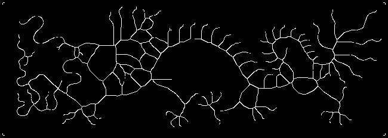

<center>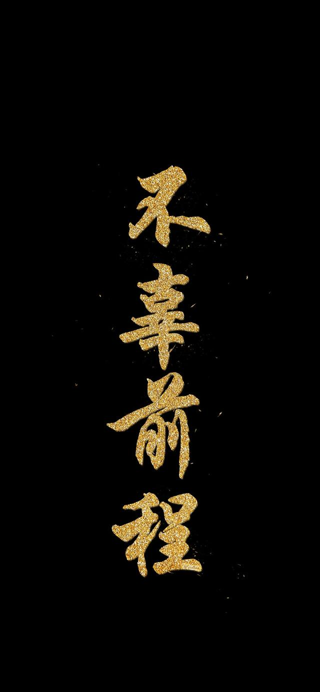    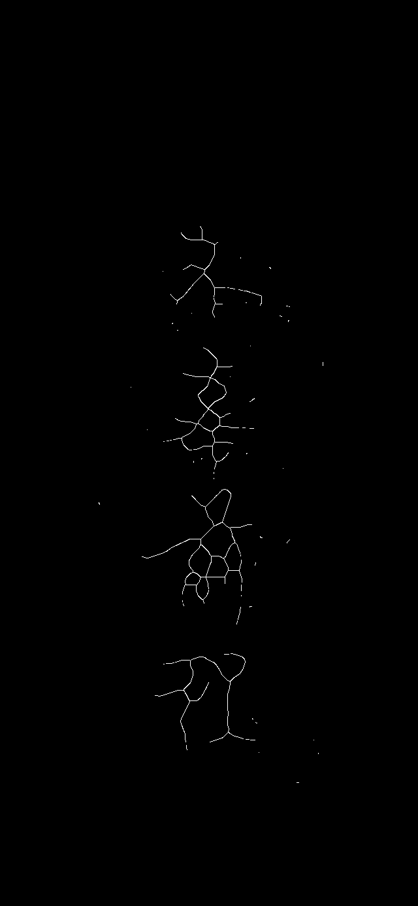</center>


## 十、总结

​		本次作业要求实现形态学滤波的相关操作，大津法和开闭运算在理解了原理后都比较容易，相对而言骨架细化的原理较为复杂，同时结构元序列的选取会对结果造成很大影响，这里就直接用了最常用的一组结构没有自己调整，骨架提取还有另外的几种方法，不过效果各异，没有明显的优劣。