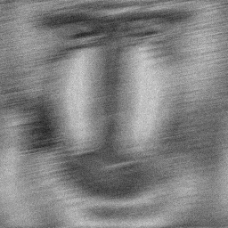
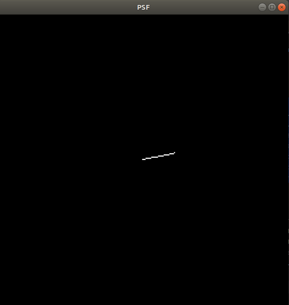
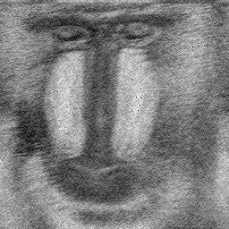
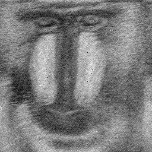

# 图像复原

​	**姓名**： 胡天扬

​	**学号**： 3190105708

​	**专业**： 自动化（控制）

​	**课程**： 数字图像处理与机器视觉	

​	**指导教师**： 姜伟


## 一、题目要求

​		图像是长度为30、逆时针方向角度为11、加有高斯白噪声的移动模糊图像。试用一种方法复原该图像。


## 二、原图



​		图像为灰度图，尺寸为`256 x 256`。


## 三、获取PSF

### 3.1 原理

​		消除图像模糊的核心是获取系统的点扩散函数（point spread function (PSF) ）。PSF描述了一个成像系统对一个点光源物体的响应。在大多情况下，PSF可以认为像是一个能够表现未解析物体的图像中的一个扩展区块。函数上讲，PSF是成像系统传递函数的空间域表达。PSF是一个重要的概念，傅里叶光学、天文成像、医学影像、电子显微学和其他成像技术比如三维显微成像和荧光显微成像都有其身影。一个点状物体扩散的度是一个成像系统质量的度量。在非相关成像系统中，成像过程是在能量上是线性的，可以通过线性系统理论来表达，即A和B两个物体同时成像的时候，成像结果等同于A、B两物体独立成像的结果之和。更为复杂物体的图像可以看做是真实物体和PSF的卷积。

​		在数学上，物平面域可以表示为
$$
O\left(x_{o}, y_{o}\right)=\iint O(u, v) \delta\left(x_{o}-u, y_{o}-v\right)dudv
$$
​		将物透射函数改写为上述形式，可以将像平面域计算为各个脉冲函数图像的叠加，即作为像平面的加权点扩展函数与物平面中相同的权重函数的叠加。因此，图像可以表示为
$$
I\left(x_{o}, y_{o}\right)=\iint O(u, v) \operatorname{PSF}\left(x_{i} / M-u, y_{i} / M-v\right) d u d v
$$
​		对于直线运动的模糊图像而言，系统的传递函数可以表示为
$$
{H}({u}, {v})=\int_{0}^{T} \exp \left\{-j 2 \pi\left[{u x} {x}_{0}({t})+{v} {y}_{0}({t})\right]\right\} {d} {t}
$$
​		这就是匀速直线运动所造成的图像模糊系统的传递函数，进行傅立叶反变换就可以得出系统的点扩展函数，由傅里叶变换的空间位移性质可知该传递函数是位移传递函数的积分。

### 3.2 代码

```python
def get_psf(src, angle, offset):
    x_center = int((src.shape[0] - 1) / 2)
    y_center = int((src.shape[1] - 1) / 2)
    psf = np.zeros(src.shape)
    for i in range(offset):
        x_offset = round(np.sin(angle * np.pi / 180) * i)
        y_offset = round(np.cos(angle * np.pi / 180) * i)
        psf[int(x_center - x_offset), int(y_center + y_offset)] = 1
    return psf
```

### 3.3 运行结果




## 四、维纳滤波

### 4.1 原理

​		在信号处理中，维纳滤波是常用的降噪方法，它能够把实际信号从带有噪声的观测量中提取出来，无论是在语言信号还是图像信号中，维纳滤波都有重要的应用。维纳滤波是一种线性最小均方误差（LMMSE)估计,线性指的是这种估计形式是线性的，最小方差则是我们后面构造滤波器的优化准则，也就是说实际信号与估计量的差 $y-\hat{y}$ 要有最小的方差。而维纳滤波就是要构造一种滤波器，使得观测信号通过滤波器后能够得到的输出是实际信号的最小均方误差估计。

​		设运动图像为 $f(x,y)$，其傅里叶变换为 $F(u,v)$，设模糊后的图像为 $g(x,y)$，其傅里叶变换为 $G(u,v)$，通过 $F(u,v)$ 和 $H(u,v)$ 频域相乘得到 $G(u,v)$，即
$$
G(u, v)=F(u, v) H(u, v)
$$
​		维纳滤波复原公式如下，当 $K=0$ 时，即为逆滤波
$$
\hat{F}(u, v)=\frac{G(u, v)}{H(u, v)} \frac{|H(u, v)|^{2}}{\left(|H(u, v)|^{2}+K\right)}
$$

### 4.2 代码

​		这里的参数 $var$ 和 $K$ 由自己设定，其中 $var$ 是估计的噪声方差。

```c++
def wiener(src, psf, var, K=0.02):
    src_fft = np.fft.fft2(src)
    psf_fft = np.fft.fft2(psf) + var
    dst = np.fft.ifft2(src_fft * np.conj(psf_fft) / (np.abs(psf_fft) ** 2 + K))
    dst = np.abs(np.fft.fftshift(dst))
    return dst
```

### 4.3 运行结果

​											逆滤波 (K=0)									维纳滤波 (K=0.02)

<center>			</center>


## 五、其他 

### 5.1 主函数

```python
def main():
    args = get_args()
    input_image = read_image(args.image_root, args.image_name)
    psf_image = get_psf(input_image, args.motion_angle, args.motion_offset)
    inverse_image = wiener(input_image, psf_image / psf_image.sum(), 0).astype(np.uint8)
    wiener_image = wiener(input_image, psf_image / psf_image.sum(), args.noise_var).astype(np.uint8)

    # visualize
    show_image("Original image", input_image, size=(600, 600))
    show_image("PSF", psf_image, size=(600, 600))
    show_image("Inverse image", inverse_image, "inverse.png", args.image_root, args.save_image, size=(600, 600))
    show_image("Wiener image", wiener_image, "wiener.png", args.image_root, args.save_image, size=(600, 600))
    plt.figure(figsize=(18, 8))
    plt.subplot(141), plt.title("Original image"), plt.axis('off'), plt.imshow(input_image, 'gray')
    plt.subplot(142), plt.title("PSF"), plt.axis('off'), plt.imshow(psf_image, 'gray')
    plt.subplot(143), plt.title("Inverse filter"), plt.axis('off'), plt.imshow(inverse_image, 'gray')
    plt.subplot(144), plt.title("Wiener filter"), plt.axis('off'), plt.imshow(wiener_image, 'gray')
    plt.tight_layout()
    plt.savefig(os.path.join(args.image_root, "results.png"))
    plt.show()
```

### 5.2 命令行参数

```python
def get_args():
    parser = argparse.ArgumentParser(description="Arguments", formatter_class=argparse.ArgumentDefaultsHelpFormatter)
    parser.add_argument("--image_name",     type=str,   default="monkey.bmp",   help="Input image name")
    parser.add_argument("--image_root",     type=str,   default="./images",     help="Root of images")
    parser.add_argument("--save_image",     action="store_true",                help="Save images to image_root")
    parser.add_argument("--motion_angle",   type=float, default=11,             help="Rotation angle of image")
    parser.add_argument("--motion_offset",  type=float, default=30,             help="Offset of image")
    parser.add_argument("--noise_var",      type=float, default=0.02,           help="Variance of Gaussian noise")
    return parser.parse_args()
```

​		若要保存图像则在命令行运行时加入`--save_image`。

### 5.3 读取图像

```python
def read_image(root, name):
    image_path = os.path.join(root, name)
    if not os.path.isfile(image_path):
        print("Path error!")
        exit()
    input_image = cv2.imread(image_path, 0)
    print("image shape: {}".format(input_image.shape))
    return input_image
```

### 5.4 展示单幅图像

```python
def show_image(win_name, image, save_name=None, save_path=None, isSave=False, wait_key=0, size=None):
    if size is not None and size != (0, 0):
        cv2.namedWindow(win_name, cv2.WINDOW_NORMAL)
        cv2.resizeWindow(win_name, size[0], size[1])
    else:
        cv2.namedWindow(win_name, cv2.WINDOW_AUTOSIZE)

    cv2.imshow(win_name, image)
    if wait_key >= 0:
        cv2.waitKey(wait_key)
    if save_path is not None and isSave:
        cv2.imwrite(os.path.join(save_path, save_name), image)
```

​		**这里遇到一个大坑，`opencv`在显示傅里叶变换后的图像时，必须转换成`np.uint8`类型，否则只能用`matplotlib`显示。**


## 六、总结

​		本次作业为图像复原，由于高斯噪声的方差未知，因此基本可以直接使用维纳滤波。这次最头疼的地方不是原理部分，而是图像像素的操作，`cpp`对像素的操作实在过于复杂了，再加上需要考虑不同数据类型的转换和精度损失，以及傅里叶变换等也没有很对应的函数，所以写完PSF之后就放弃了，也是我第一次在本课程中用`python`来编程，不得不说编程效率是真的高，写起来是真的爽。