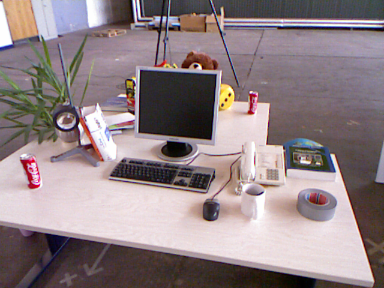
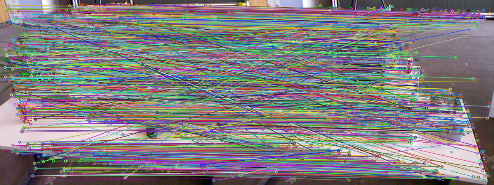
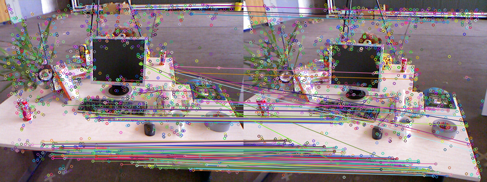

# 特征匹配

​	**姓名**： 胡天扬

​	**学号**： 3190105708

​	**专业**： 自动化（控制）

​	**课程**： 数字图像处理与机器视觉	

​	**指导教师**： 姜伟


## 一、题目要求

​		编程实现 SIFT、SURF、ORB 等图像特征提取算法，并比较各算法性能。


## 二、原图

<center> </center>

​		输入是两张不同角度的图像，图像尺寸为`480 x 640`。


## 三、ORB

### 3.1 原理

​		具体原理就略去了，毕竟是上机作业，其实原理在代码里都已经体现了，已 $ORB$ 为例进行说明。

### 3.2 代码

```c++
/*
 * ORB
 */
vector<KeyPoint> key_points1, key_points2;
Mat descriptions1, descriptions2;
Ptr<ORB> orb = ORB::create(500, 1.2f, 8, 31, 0, 2, ORB::HARRIS_SCORE,31,20);

// (1) 检测 Oriented FAST 角点位置
orb->detect(img1, key_points1);
orb->detect(img2, key_points2);

// (2) 由角点位置计算 BRIEF 描述子
orb->compute(img1, key_points1, descriptions1);
orb->compute(img2, key_points2, descriptions2);

Mat orb_img;
drawKeypoints(img1, key_points1, orb_img, Scalar::all(-1), DrawMatchesFlags::DEFAULT);
showImage("ORB特征点", orb_img, image_size, 0, "../../images/ORB_features.png");

// (3) 用 Hamming 距离匹配两帧中的 BRIEF
vector<DMatch> matches_orb;
BFMatcher matcher_orb(NORM_HAMMING);
matcher_orb.match(descriptions1, descriptions2, matches_orb);

// (4) 筛选配对点
// 找出最大和最小距离
double min_dist = 10000, max_dist = 0;
for (int i = 0; i < descriptions1.rows; i++)
{
    double dist = matches_orb[i].distance;
    if (dist < min_dist)
        min_dist = dist;
    if (dist > max_dist)
        max_dist = dist;
}

// 描述子距离大于两倍最小值或经验值时，认为匹配有误
vector<DMatch> good_matches_orb;
for (int i = 0; i < descriptions1.rows; i++)
    if (matches_orb[i].distance <= max(2*min_dist, 30.0))
        good_matches_orb.push_back(matches_orb[i]);

// (5) 绘制匹配结果
Mat img_match, img_good_match;
drawMatches(img1, key_points1, img2, key_points2, matches_orb, img_match);
drawMatches(img1, key_points1, img2, key_points2, good_matches_orb, img_good_match);
showImage("ORB所有匹配点", img_match, image_size, 0, "../../images/ORB_all_matches.png");
showImage("ORB优化后的匹配点", img_good_match, image_size, 0, "../../images/ORB_good_matches.png");
destroyAllWindows();
```

​		**在获取两幅图像的描述子后，根据最大汉明距离进行筛选，得到优化后的匹配。**

### 3.3 运行结果


<center>ORB特征点


<center>ORB全部特征匹配


<center>ORB优化后的特征匹配


## 四、SIFT

### 4.1 运行结果


<center>SIFT特征点


<center>SIFT得全部特征匹配


<center>SIFT优化后的特征匹配


## 五、SURF

### 5.1 运行结果


<center>SURF特征点



<center>SURF得全部特征匹配



<center>SURF优化后的特征匹配


## 六、算法比较

​		可以说 SIFT 是尺度不变特征检测的开山之作，但是 SIFT 的缺陷也很明显：实时性不高、特征点少、对边缘光滑的图像效果差。而ORB、SURF 都是在 SIFT 上做出的改进，SURF 的运算简单，效率更高，检测的特征点也更多；ORB则效果更为显著，效率也更高。

​		特征点检测数量：SURF > ORB > SIFT

​		检测特征点时间：ORB < SURF < SIFT


## 七、总结

​		`opencv3`之后 SURF 被移出去了，要多装个`opencv_contrib`，代码上由于这部分之前接触过，所以没有什么难度。