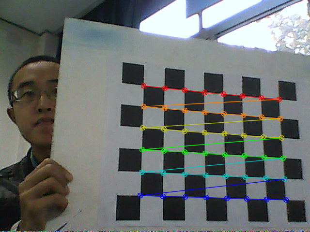

# 相机标定

​	**姓名**： 胡天扬

​	**学号**： 3190105708

​	**专业**： 自动化（控制）

​	**课程**： 数字图像处理与机器视觉	

​	**指导教师**： 姜伟


## 一、题目要求

​		使用标定板图像（方格尺寸为3厘米），实践张正友相机标定方法。


## 二、原理

​		首先理解四个坐标系之间的关系


​		


​		以及径向和切向的畸变
$$
\left\{\begin{array}{l}
x_{\text {corrected }}=x\left(1+k_{1} r^{2}+k_{2} r^{4}+k_{3} r^{6}\right)+2 p_{1} x y+p_{2}\left(r^{2}+2 x^{2}\right) \\
y_{\text {corrected }}=y\left(1+k_{1} r^{2}+k_{2} r^{4}+k_{3} r^{6}\right)+p_{1}\left(r^{2}+2 y^{2}\right)+2 p_{2} x y
\end{array}\right.
$$
​		张正友标定法利用棋盘格标定板，在得到一张标定板的图像之后，可以利用相应的图像检测算法得到每一个角点的像素坐标 $(u,v)$。同时将世界坐标系固定于棋盘格上，则棋盘格上任一点的物理坐标 $W=0$，由于标定板的世界坐标系是人为事先定义好的，标定板上每一个格子的大小是已知的，我们可以计算得到每一个角点在世界坐标系下的物理坐标 $(U,V,W=0)$。然后我们就利用每一个角点的像素坐标 $(u,v)$、每一个角点在世界坐标系下的物理坐标 $(U,V,W=0)$，来进行相机的标定，获得相机的内外参矩阵、畸变参数。

​		详见[张正友相机标定法](https://blog.csdn.net/weixin_41480034/article/details/121759128)。


## 三、代码

​		在循环读入每张图像后提取其角点，然后经过亚像素精确化得到亚像素角点。在获取了所有图片的坐标后，通过张正友标定法来计算相机的内外参。最后用标定得到的内外参反投影回3D坐标，计算像素误差，验证标定的准确性。

​		其中需要自己定义的参数有三个：`points_per_row：每行内角点数量`，`points_per_col：每列内角点数量`，`block_size：标定方格的大小`。

​		需要读入图像的名字存放在`images/file_names.txt`文件下，共27幅图像。

```cpp
/*
 * @Description:
 * @version: v1.0
 * @Author: HTY
 * @Date: 2022-06-01 11:36:18
 */

#include <iostream>
#include <fstream>
#include <string>
#include "boost/format.hpp"
#include <opencv2/opencv.hpp>

using namespace std;

bool isSave = true;
void showImage(const std::string & win_name, cv::Mat & mat, cv::Size size, int wait_key=0, const std::string & save_path="");


int main(int argc, char **argv)
{
    string image_root = "../../images/calibration_target/";    // image root of calibration target
    boost::format save_fmt("../../images/corners/%s_corner.png");  // image names of corners
    ifstream fin("../../images/file_names.txt");    // file names of images in calibration target
    if (!fin)
    {
        cout << "Cannot find files of image names!" << endl;
        return -1;
    }
    ofstream fout("../../calibration_result.txt");  // results

    /* (1) corner detection */
    int image_number = 0;       // image numbers
    cv::Size image_size;        // image size
    int points_per_row = 8;
    int points_per_col = 6;
    cv::Size corner_size = cv::Size(points_per_row, points_per_col);
    vector<cv::Point2f> points_per_image;
    vector<vector<cv::Point2f>> points_all_images;

    string image_name;
    while (getline(fin, image_name))
    {
        image_number++;
        cv::Mat image_raw = cv::imread(image_root + image_name);
        if (image_raw.empty())
        {
            cout << "Path error!" << endl;
            return -1;
        }
        if (image_number == 1)
        {
            image_size.width = image_raw.cols;
            image_size.height = image_raw.rows;
            cout << "image_size.width = " << image_size.width << endl;
            cout << "image_size.height = " << image_size.height << endl;
        }

        cv::Mat image_gray;
        cv::cvtColor(image_raw, image_gray, cv::COLOR_BGR2GRAY);

        // find corners
        bool success = cv::findChessboardCorners(image_gray, corner_size, points_per_image);
        if (!success)
        {
            cout << "Cannot find the corners for image " << image_name << endl;
            image_number--;
        }
        else
        {
            // subpixel corner detection
            cv::find4QuadCornerSubpix(image_gray, points_per_image, cv::Size(5, 5));
            points_all_images.push_back(points_per_image);
            
            // visualize and save image
            cv::drawChessboardCorners(image_raw, corner_size, points_per_image, success);
            showImage("Corner detection", image_raw, cv::Size(), -1, (save_fmt % image_name).str());
        }
    }
    cv::destroyAllWindows();
    cout << "image_numbers = " << (int) points_all_images.size() << endl;

    // calibration
    cv::Size block_size(3, 3);  // size of each grid
    cv::Mat K(3, 3, CV_32FC1, cv::Scalar::all(0));   // inner param
    cv::Mat dist_coef(1, 5, CV_32FC1, cv::Scalar::all(0)); // distortion coefficients
    vector<cv::Mat> R;  // rotation matrix
    vector<cv::Mat> T;  // translation matrix

    vector<cv::Point3f> points3D_per_image;
    for (int i = 0; i < corner_size.height; i++)
        for (int j = 0; j < corner_size.width; j++)
            points3D_per_image.emplace_back(block_size.width * j, block_size.height * i, 0);

    vector<vector<cv::Point3f>> points3D_all_images(image_number,points3D_per_image);   // 3d coordinates
    
    // calibration
    cv::calibrateCamera(points3D_all_images, points_all_images, image_size, K, dist_coef, R, T, 0);

    // validation
    cout.precision(4);
    fout.precision(4);
    cout.setf(ios::fixed);
    fout.setf(ios::fixed);
    double err = 0.0, total_err = 0.0;
    vector<cv::Point2f> points_reproject;
    cout << "\nCalibration error of each image:\n";
    fout << "Calibration error of each image:\n";
    for (int i = 0; i < image_number; i++)
    {
        points3D_per_image = points3D_all_images[i];
        // reprojection by calibrated params
        cv::projectPoints(points3D_per_image, R[i], T[i], K, dist_coef, points_reproject);
        
        // calculate error
        vector<cv::Point2f> detect_points = points_all_images[i];
        cv::Mat detect_points_Mat = cv::Mat(1, (int) detect_points.size(), CV_32FC2);
        cv::Mat reproject_points_Mat = cv::Mat(1, (int) points_reproject.size(), CV_32FC2);
        for (int j = 0; j < detect_points.size(); j++)
        {
            detect_points_Mat.at<cv::Vec2f>(0, j) = cv::Vec2f(detect_points[j].x, detect_points[j].y);
            reproject_points_Mat.at<cv::Vec2f>(0, j) = cv::Vec2f(points_reproject[j].x, points_reproject[j].y);
        }
        err = cv::norm(reproject_points_Mat, detect_points_Mat, cv::NormTypes::NORM_L2);
        total_err += err /= corner_size.area();
        cout << "Mean pixel error of image " << i << ": " << err << endl;
        fout << "Mean pixel error of image " << i << ": " << err << endl;
    }
    cout << "\nMean pixel error of whole images: " << total_err << endl;
    fout << "\nMean pixel error of whole images: " << total_err << endl;

    // save params
    cv::Mat rotation = cv::Mat(3, 3, CV_32FC1, cv::Scalar::all(0));
    cout << "\ncamera intrinsics:" << endl;
    cout << K << endl;
    fout << "\ncamera intrinsics:" << endl;
    fout << K << endl;
    cout << "\ndistortion coefficients:" << endl;
    cout << dist_coef << endl << endl;
    fout << "\ndistortion coefficients:" << endl;
    fout << dist_coef << endl << endl;

    for (int i = 0; i < image_number; i++)
    {
        cv::Rodrigues(R[i], rotation);    // convert rotation vector to rotation matrix
        fout << "rotation matrix of image " << i << ":" << endl;
        fout << rotation << endl;
        fout << "translation matrix of image " << i << ":" << endl;
        fout << T[i] << endl;
    }
    fout.close();

    return 0;
}


void showImage(const std::string & win_name, cv::Mat & mat, cv::Size size, int wait_key, const std::string & save_path)
{
    if (!size.empty() and size != cv::Size(0, 0))
    {
        cv::namedWindow(win_name, cv::WINDOW_NORMAL);
        cv::resizeWindow(win_name, size);
    }
    else
        cv::namedWindow(win_name, cv::WINDOW_AUTOSIZE);

    cv::imshow(win_name, mat);
    if (wait_key >= 0)
        cv::waitKey(wait_key);
    if (!save_path.empty() && isSave)
        cv::imwrite(save_path, mat);
}
```


## 四、运行结果

​		提取角点时命令行有如下输出，表明有一幅图像提取失败，原因也挺明显的，就是图像本身的问题。

```shell
Cannot find the corners for image c-0001.ppm
```


​		其他图像提取角点后的效果如下，保存在`images/corners/`文件夹下。



​		最后的标定数据保存在`calibration_result.txt`文件中。

```txt
Calibration error of each image:
Mean pixel error of image 0: 0.0601
Mean pixel error of image 1: 0.1155
Mean pixel error of image 2: 0.0673
Mean pixel error of image 3: 0.0843
Mean pixel error of image 4: 0.0741
Mean pixel error of image 5: 0.0618
Mean pixel error of image 6: 0.0729
Mean pixel error of image 7: 0.0715
Mean pixel error of image 8: 0.0632
Mean pixel error of image 9: 0.0653
Mean pixel error of image 10: 0.0802
Mean pixel error of image 11: 0.0724
Mean pixel error of image 12: 0.0704
Mean pixel error of image 13: 0.0612
Mean pixel error of image 14: 0.0591
Mean pixel error of image 15: 0.0551
Mean pixel error of image 16: 0.0625
Mean pixel error of image 17: 0.0727
Mean pixel error of image 18: 0.0772
Mean pixel error of image 19: 0.0586
Mean pixel error of image 20: 0.0624
Mean pixel error of image 21: 0.0588
Mean pixel error of image 22: 0.0593
Mean pixel error of image 23: 0.0548
Mean pixel error of image 24: 0.1134
Mean pixel error of image 25: 0.0634

Mean pixel error of whole images: 1.8174

camera intrinsics:
[690.3781500845372, 0, 335.5325201106766;
 0, 689.9102182599723, 272.5908523143349;
 0, 0, 1]

distortion coefficients:
[0.3885444956907605, -1.49135645073175, -0.001226501924413693, -0.002594126301883166, 1.704359328513067]

以及每幅图像的R、t矩阵参数
```


## 五、总结

​		张正友标定法的总体原理不是很难，需要了解基本的相机成像过程。不过在得到Homography矩阵后还需要进行内外参的求解，有亿点点麻烦，所以就调用了库函数来求解。