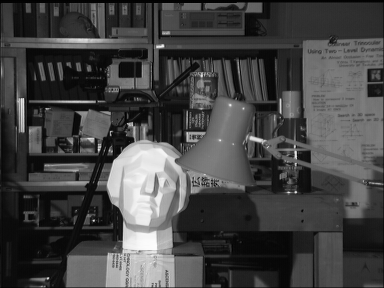
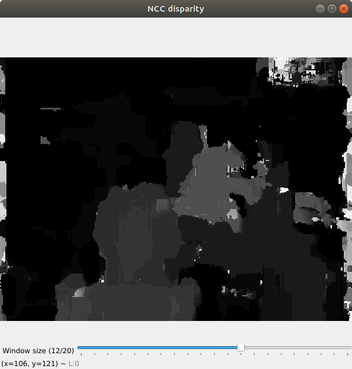
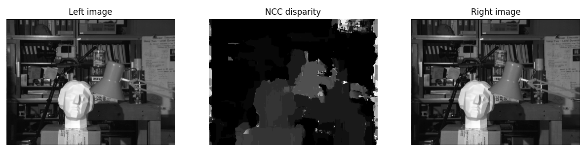
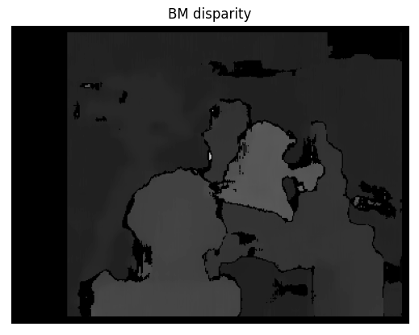
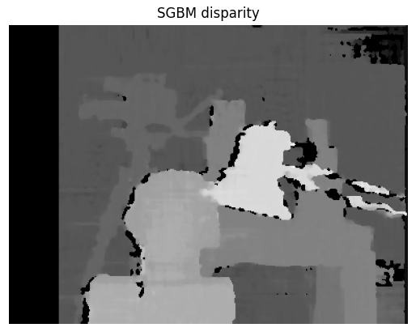

# 双目三维重建

​	**姓名**： 胡天扬

​	**学号**： 3190105708

​	**专业**： 自动化（控制）

​	**课程**： 数字图像处理与机器视觉	

​	**指导教师**： 姜伟


## 一、题目要求

​		针对附件图像对（相机平行配置），编写代码实现双目三维重建过程，计算视差图。


## 二、原图

​		给定图像为平行配置的相机所拍出的左右图像，图像大小为`384×288`。

<center> </center>


## 三、NCC

### 3.1 原理

​		NCC（normalized cross-correlation）对于原始的图像内任意一个像素点 $(px,py)$ 构建一个`n×n`的邻域作为匹配窗口。然后对于目标相素位置 $(px+d, py)$ 同样构建一个`n×n`大小的匹配窗口，对两个窗口进行相似度度量。

​		计算公式如下，当 $NCC(\mathrm{p}, \mathrm{d})$ 的值为-1时，表明两个窗口完全不相关，值为1时相关程度最高。

$$
NCC(\mathrm{p}, \mathrm{d})=\frac{\sum_{(x, y) \in \mathbb{W}_{p}}\left(I_{1}(x, y)-\overline{I 1}\left(p_{x}, p_{y}\right)\right) \bullet\left(I_{2}(x+d, y)-\bar{I}_{2}\left(p_{x}+d, p_{y}\right)\right)}{\sqrt{\sum_{(x, y) \in \mathbb{W}_{p}}\left(I_{1}(x, y)-\bar{I}_{1}\left(p_{x}, p_{y}\right)\right)^{2} \bullet \sum_{(x, y) \in \mathbb{F}_{p}}\left(I_{2}(x+d, y)-\bar{I}_{2}\left(p_{x}+d, p_{y}\right)\right)^{2}}}
$$
​		每个像素都会有一个窗口存有 $NCC$ 值，最终需要取其中最大值对应的 $d$ 值作为视差图在该像素点的灰度值。

### 3.2 代码

​		原理看上去不难，代码实现上需要一些技巧，这里用到了`np.roll()`进行窗口的滑动。

```python
def ncc(image_l, image_r, window_size, steps, offset):
    """
    ncc disparity map
    :param image_l: left image
    :param image_r: right image
    :param window_size: size of slipping window
    :param steps: 
    :param offset: start index of pixel
    :return: disparity image ranging from [0, 255]
    """
    h, w = image_l.shape
    # init matrix
    mean_l = np.zeros((h, w))
    mean_r = np.zeros((h, w))
    sum_l_r = np.zeros((h, w))  # numerator of NCC formular
    sum_l = np.zeros((h, w))    # denominator of NCC formular
    sum_r = np.zeros((h, w))    # denominator of NCC formular
    depth = np.zeros((steps, h, w))
    # get mean value of silp window
    uniform_filter(image_l, window_size, mean_l)
    uniform_filter(image_r, window_size, mean_r)
    # normalize
    norm_l = image_l - mean_l
    norm_r = image_r - mean_r

    # recurrent to calculate sum
    for i in range(steps):
        uniform_filter(np.roll(norm_l, -i - offset) * norm_r, window_size, sum_l_r)
        uniform_filter(np.roll(norm_l, -i - offset) * np.roll(norm_l, -i - offset), window_size, sum_l)
        uniform_filter(norm_r * norm_r, window_size, sum_r)
        depth[i] = sum_l_r / np.sqrt(sum_l * sum_r)

    # renormalization
    disparity = np.argmax(depth, axis=0)
    disparity = (disparity / disparity.max() * 255).astype(np.uint8)
    return disparity
```

​		窗口大小是个可变参数，因此添加滑杆。

```python
# create trackbar of window size
win_name = "NCC disparity"
cv2.namedWindow(win_name, cv2.WINDOW_NORMAL)
cv2.resizeWindow(win_name, 600, 600)
cv2.imshow(win_name, disparity)
cv2.createTrackbar("Window size", win_name, 0, 20, callback)
cv2.setTrackbarPos("Window size", win_name, 12)
cv2.waitKey(0)
    
def callback(window_size):
    """
    :param window_size: param on trackbar
    :return: 
    """
    args = get_args()
    image_l, image_r = read_image(args.image_root, args.image_name)
    disparity = ncc(image_l, image_r, window_size, args.steps, args.offset)
    cv2.imshow("NCC disparity", disparity)
```

​		以及参数读取、图片读取和可视化。

```python
def get_args():
    parser = argparse.ArgumentParser(description="Arguments")
    parser.add_argument("--image_name", type=str,   nargs=2,    default=["tsukuba_l.png", "tsukuba_r.png"], help="Input image names")
    parser.add_argument("--image_root", type=str,   default="../images/",   help="Root of images")
    parser.add_argument("--steps",      type=int,   default=30,             help="Steps of slip window")
    parser.add_argument("--offset",     type=int,   default=5,              help="Offset")
    parser.add_argument("--window_size",type=int,   default=12,             help="Window size")
    return parser.parse_args()

def read_image(root, names):
    """
    read image from root
    :param root: image_root
    :param names: image_name
    :return: gray images  type: np.ndarray
    """
    path1 = os.path.join(root, names[0])
    path2 = os.path.join(root, names[1])
    if not os.path.isfile(path1) or not os.path.isfile(path2):
        print("Path error!")
        exit()
    image_l = cv2.imread(path1, 0)
    image_r = cv2.imread(path2, 0)
    return image_l, image_r

# visualize
plt.figure(figsize=(15, 6))
plt.subplot(131), plt.title("Left image"), plt.axis("off"), plt.imshow(image_l, "gray")
plt.subplot(133), plt.title("Right image"), plt.axis("off"), plt.imshow(image_r, "gray")
plt.subplot(132), plt.title("NCC disparity"), plt.axis("off"), plt.imshow(disparity, "gray")
plt.savefig(args.image_root + "NCC.png")
plt.tight_layout()
plt.show()
```

### 3.3 运行结果






## 四、BM

### 4.1 代码

​		BM（Block Matching）匹配算法也是常见的三维重建方法之一，不过这里就直接调用了库函数。

```python
image_l = cv2.imread('../images/tsukuba_l.png', 0)
image_r = cv2.imread('../images/tsukuba_r.png', 0)
stereo = cv2.StereoBM_create(numDisparities=48, blockSize=15)
disparity = stereo.compute(image_l, image_r)

plt.title("BM disparity")
plt.imshow(disparity, 'gray')
plt.axis("off")
plt.savefig("../images/BM_disparity.png")
plt.show()
```

### 4.2 运行结果




## 五、SGBM

### 5.1 代码

​		SBMG（Semi-Global-Block Matching）是一种半全局匹配算法，这里也直接调用了库函数。

```python
image_l = cv2.imread('../images/tsukuba_l.png', 0)
image_r = cv2.imread('../images/tsukuba_r.png', 0)
stereo = cv2.StereoSGBM_create(0, 48, 3, 8 * 3 * 3, 32 * 3 * 3, 2, 63, 15, 100, 1, cv2.StereoSGBM_MODE_SGBM_3WAY)
disparity = stereo.compute(image_l, image_r)

plt.title("SGBM disparity")
plt.imshow(disparity, 'gray')
plt.axis("off")
plt.savefig("../images/SGBM_disparity`.png")
plt.show()
```

### 5.2 运行结果




## 六、比较

​		这三种算法都需要进行合理地调参才能得到较好的视差计算效果。其中，BM算法处理速度快，但是只能对8位灰度图像计算视差，而SGBM算法可以处理24位彩色图像，能够获得比BM算法物体轮廓更清晰的视差图，速度比BM稍慢。
​		NCC算法的优点是抗白噪声干扰能力强，且在灰度变化及几何畸变不大的情况下匹配精度很高。但该方法受局部光照变化的影响，且匹配速度较慢。


## 七、总结

​		本次实验又是用`python`来实现的，毕竟快考试周了所以用`python`提高一下编程效率。NCC视差计算没有用到库函数，但是其中的`np.roll()`参考这篇博客：[传送门](https://blog.csdn.net/wwq0726/article/details/105763398)，实现得非常巧妙，展现出`python`的简洁性。以及仍需注意`cv2.imshow()`必须是`np.uint8`格式才能正常显示。另外，为了避免调参的痛苦，直接用滑杆来显示图像，效果还是比较好的。